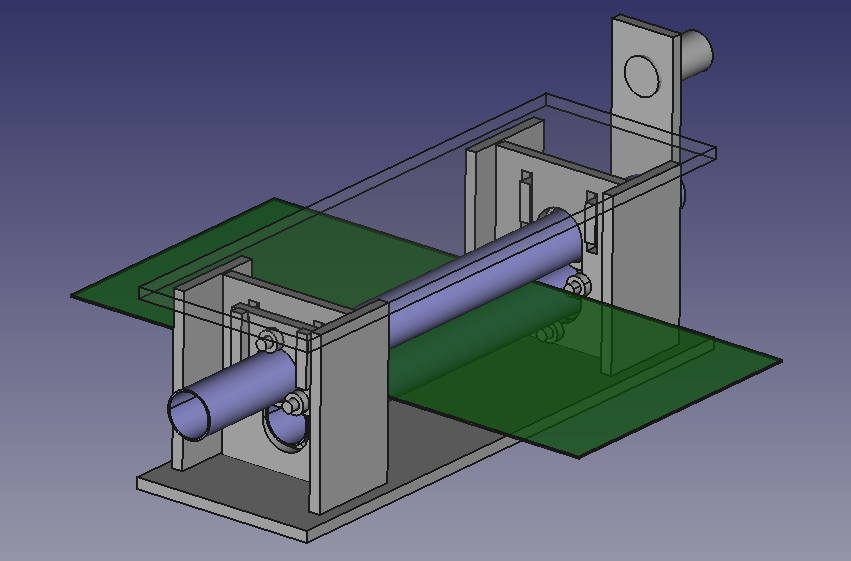

Research in end-to-end, local and systainable, use of bioplastic.

from raw materials that can be grown,
to useful produced items,
to recycling of the items at end of life.

Using high-technology, low-scale and low-labor intensity processes.

Tests
=======

Starch-based hydrolysis
-----------------------

During weekend of March 14-15, a series of simple starch-based plastics was created using hydrolysis.
Gelatine, corn-starch and agar was used as starch sources. Glyserol was used as the plasticizer.
The material was spread into thin sheets, 0.5 mm - 2 mm.
Both on its own, onto cotton fabric and mixed with wood filler.

[How to make starch bioplastic](https://www.youtube.com/watch?v=LskPNBvbuqM)

Take-aways

* Drying under a oven heater drastically improves drying time, down to 3-4 hours for ~1 mm.
* Fabric sheets will warp if only dried from one side and tend to curl up fabric.
* Drying on aluminum sheets seems to keep warping down
* When drying on platic/alu, the side that is down does not dry out (as water cannot escape)
* Maintaining even dimension impossible when spreading plastic out with spatula
* Pouring into a base mold, taking out to dry when solidified, yielded relatively consistent height
* Olive oil worked excellently as a mold release agent (with gelatine-based plastic)
* Recipies that use a lot of water (10-100 parts to 1 part starch) seem to primarily takes longer to cook/dry
Around 5 parts starch to water is enough for the hydrolysis. Breakdown of the amylose is unknown.
* **Sensitivity to water** is a problem. When the finished plastic is exposed to water, it dissolves

Conclusion

The plastic was very easy to create with low amounts of water, but the hydroscopic nature drastically
reduces possible applications.

Next steps

* Attempt a protein (casein) based plastic/rubber, denatured with tannic acid
* Attempt a propein (casein) based plastic, hardened with Ammonium Alum
* Attempt to mix casein plastic with starch-plastic , see if water insolubility is preserved
* Research polymerizing in another type of solution (methanol? alkali? etc)

Ideas
======

Production techniques
---------------------

* Vacumforming
* 3d-printing
* Molding
* Extrusion & CNC mill
* Foam-production and cutting

Polymer sources
----------------

* Starch (potato, corn, agar)
* Protein (soy/whey, casein)
* Cellulouse (wood)
* Lignin (wood)

Extraction and polymerization processes
---------------------------

* Chemically
* Mechanically
* Biologically (bacteria)

Recyling processes
------------------

Bioplastic

* PLA + wood fill produced by milling -> remelt, sheet material for new milling

Non-bioplastic

* HDPE: shred, reheat, use directly for vacumforming
* HDPE: shred, reheat, press into sheets. Thick for milling, thin for vacumforming later
* HDPE: shred, reheat, extrude into rough additive shape, mill finishing
* LDPE: mix with stearine wax, use as mold material with milling

Tools
------
1) start/bootstrap
2) scalable: automated/reproducible

* Shredder: 1) cut manually w/scissors 2) paper shredder, wood shredder???
* Heater: 1) Soldering/kitchen oven 2) CNC/laser MDF/HDF + wirewound/infraheater
* Frames: 1) Make from scrapwood 2) CNC/laser MDF
* Plate press: 1) scrapwood + clamps 2) CNC/laser MDF/HDF + 
* Vacuum table: 1) Make from scrapwood 2) CNC/laser MDF
* Magnet stirrer, when doing hydrolysis of plastic

## Shredder

Should automatically

* [Precious plastics shredder](https://preciousplastic.com/en/videos/build/shredder.html).
Mechanics designed to be built in mechanical workshop. Steel parts, for laser/plasma/watercutting.
Good teeth profile, has space for mesh in bottom for decicing particule size.
Could be improved for making in a fablab? M8 threaded rods instead of hexagonal, with 608 bearings.
Existing M10 rods should also become M8.
Knife pices are a mix of 5 and 6mm thickness, to provide clearance in cut.
Can it be made in wood (ply/HDF) instead of metal? Much faster to CNC.
Either using epoxy coating to harden surface, or 1mm steelplate along.
Could one use a more "standard" motor? Could NEMA23 with large gear be enough? 
* [Open source mini plastic shredder](https://grabcad.com/library/mini-shredder--1)
* [Appropedia page on shredders](http://www.appropedia.org/Waste_plastic_extruder#Plastic_Grinding)
* [Filamaker open hardware shredder](http://filamaker.eu/product/mini-shredder/)
Can a similar type shredder be build using bicyle gears/sprockets?
* [Clas Olhson shredder](http://www.clasohlson.com/no/Cotech-kompostkvern-/40-6000), needs simple hack to work well

Interesting objects to make
--------------------------

* Snapblade scissors
* Snapblade foodslicer

Challenges
-----------

# Hydrophilic

Most bioplastic interact with water, and properties vary due to it.
http://green-plastics.net/posts/70/qaa-can-i-make-waterproof-bioplastic/

One alternative is to apply a coating, that is bio-friendly and easy to produce locally.

* Bieswax
* Lanolin (sheep wool wax)
* Soy wax, from soy oil

# Tensile strength

Typically low for bioplastics.

Migitation ideas

* Strengthen using complex geometric micro/macro structures (3d print etc)
* Strengthen by adding fibers, from celloluse, hemp/jute etc

## Biocomposites

* Linen should have excellent properties, but fairly expensive.
* Nice [linen eating trays](http://www.shop-foglinen.com/products/linen-tray-natural)
* Ekoa by [Lingrove](http://lingrove.com/) flax linen fabric + bioepoxy
* Thermoformable biocomposite using [linen + PLA](https://vimeo.com/119629687)
* Flax + PLA [Biotex FlaxPLA](http://www.compositesevolution.com/products/biotex-flaxpla-400gm2-2x2-twill/)
[sold per meter](http://www.easycomposites.co.uk/#!/fabric-and-reinforcement/natural-flax-and-jute-fibres/thermoplastic-flax-and-jute/flax-44-plain-500g-pla-thermoplastic.html)
* Burlap [Panduro](http://www.pandurohobby.no/Catalogue/40-Sy-Strikk/4010-Tekstil/401055-Ovrige-tekstiler/1/725179-Strie-Natur-130-cm)
[Amazon](http://www.amazon.com/Linen-Burlap-40-Inch-40-Yard-Natural/dp/B00KSXGL9I/ref=sr_1_21?s=arts-crafts&ie=UTF8&qid=1463161429&sr=1-21&keywords=linen+fabric)
Roughly same cost as woven glass-fiber locally. Should be cut-able on lasercutter.

Sourcing locally in Oslo/Norway
-----------------------------

* Gelatine: Meny/foodstore
* Corn starch: "Maizena", Meny/foodstore
* Glyserol: Vitus/Farmacy
* Sorbitol: ??
* Ammonia: Meny/grocery??
* Infraheater: [Biltema](http://www.biltema.no/no/Bygg/VVS/Radiator-og-varme/Radiator-El/Infravarmer-1000-W-46214) / [Clas Ohlson](http://www.clasohlson.com/no/Infravarmer/36-4056)
* [Alum](https://en.wikipedia.org/wiki/Alum). White alum, Ammonium aluminium sulfate, ammonium alum, "alun". or farmacy

# Protein-based plastic

[Galalith](https://en.wikipedia.org/wiki/Galalith) was name of the commercial casein-based, formaldehyde-cured plastic popular just before WW2.
Used for button on textiles, details on furniture, and as an imitation of ivory.
It is a thermosetting plastic, so cannot be thermoformed, and not molded after having first set.
Its popularity faded due to lack of moldability, milk-shortage during war, and never recovered afterwards, due to availability of petroleum-based plastics.

By using sulfur, one can also make a kind-of [synthetic rubber](https://en.wikipedia.org/wiki/Synthetic_rubber). [How to video](https://www.youtube.com/watch?v=VzEujd7iEHU).

## Possible uses

Hardplastic objects, as replacement to doing them out of acrylic/polyurethane.
Possibly especially interesting where wanting ivory or gemstone type imitation.

There was active research in 40ies around making textiles with it, but never seemed to get to product stage?
Some mentions of producs lanital, (Italy), and aralac (USA).

## Creation

Basic steps (some are in practice interlinked)

* Extract and purify protein
* Preticipate and polymerize the protein
* Extract all water
* Hardening
* Make shape
* After-curing

If already have pure casein, seem to need a strong base to make an alkali solution.
Rubber milk video uses Potassium Hydroxide (KOH).

One can of course add dyes and pigments.
Probably also use plasticiers and other additives to adjust material properties.
Can we add filler materials somehow? In which stage would it be done?

Protein preticipate, creation of solid material from a solution. For protein this action is often called [astringent](https://en.wikipedia.org/wiki/Astringent).
[Tannins](https://en.wikipedia.org/wiki/Tannin), some inorganic salts, among other things, have this effect.

## Making useful objects

Either one makes standard-sized blocks or sheets, then CNC mills into desired objects afterwards.
However this will lead to a lot of waste, and not bring many benefits over just buying plastics.
Instead one could, direct molding into usable object, or molding of customized stock.
This roughly shaped stock can then be CNC-milled afterwards.

May have speed and material efficiency benefits, when making several objects of the same 'class',
either as part of one production series, or because one often makes similar objects.
As an example, 3d-milled busts/portraits could benefit from a custom stock instead of being a block.
Making use of this advantage may require particular CNC toolpath generation, however.

The mold could be a two-sided mold of wood, which is then put in a press.
Holes will likely be needed to let water escape.

Or, lay material around a negative shape - then use vacum-bagging to pull it tight.
Will water escape into vacum pump?

### Injection molding

* [engineerguy: Plastic Injection Molding](https://www.youtube.com/watch?v=RMjtmsr3CqA). Very thorough and easy to understand.

### Melting down

Some melt plastic in oil. Especially plastic bags.

* [Instructable: Plastic Smithing](http://www.instructables.com/id/HomemadePlastic/). Plastic bags.
* [Youtube: HDPE](https://www.youtube.com/watch?v=vlQJDgB3Iyc). Plastic bags.
* [Youtube: Melting plastic with oil](https://www.youtube.com/watch?v=Cfm8w0UzEX8). Melting plastic drinking straws

Nice advantage is that basically any energy source can be used. Transfer of heat should be much better than with air.
Could it make it possible to melt down plastic without shredding?
Can the molten blob injection molded or roller-extruded without extra heating sources?

### Sheet roller

## References

* [US Patent: Process of insoluzibiling protein fibres during manufacture](http://www.google.com/patents/US2297397).
Cites use of chrome salts (chrome alun) used in process.
"pass through a second bath of aluminium salts and of sodium chloride,
with or without formaldehyde, wherein the filaments are restrained and preliminarily hardened by the astringent action of aluminium salts,
this action being helped-on and accelerated by the presence of the sodium chloride".
* [UK Patent:  The hardening of films, fibres, filaments and fabrics made from non-cellulosic hydrophilic polymers](http://patent.ipexl.com/GB/716542-a.html).
Describes isocyanate addition and heating process to improves hardening. But also refes to other existing practices:
"Enhanced effects are obtained if the heating step is effected in the presence of an amide, thioamide, sulphonamide, amidine or aminotriazine, e.g., urea, ..."
"Treatment with other hardening agents, e.g., aldehydes, thermo-setting condensates, aluminium or chromium salts, may be applied before, simultaneously with or after the reaction product".
* [US Patent: Production of artificial protein threads, fibres, filaments and the like](https://www.google.com/patents/US2897044)
"It is known to produce threads from proteins by extruding an alkaline solution of the protein into a coagulating bath containing an acid, usually sulphuric acid,
and one or more salts having an astringent action on the freshly extruded threads, for example sodium sulphate and aluminium sulphate."
"he threads are then generally hardened, that is to say, rendered insoluble in water at ordinary temperatures,
stretched and hardened once more as described in British patent specification No. 502,710;
finally, the threads are usually subjected to an insolubilising process which renders the threads resistant to the action of boiling water or hot aqueous solutions."
* [US Patent: Tanning Process](http://www.google.com/patents/US2061063)
"It is known that tanning agents such as tannic acid, formaldehyde, formaldehyde polymers, acetaldehyde, oak extract, alum, chromium salts and similar materials will
react with casein, animal glue. vegetable proteins, hide substance and other proteins and protein containing substances to render the protein hard and more or less insoluble in water."
"in preparing insoluble films on paper, making adhesives, paints and in plastics manufacture.
A common practice is to prepare first, a film from an aqueous solution of casein which contains an alkaline agent, such as borax, for rendering the casein soluble.
The film then is dried and treated with formaldehyde, tannic acid or similar hardening agent, which causes the film to become relatively insoluble in water. "
"We have discovered that when a protein is subjected to the action of a protein hardening material in $5 the presence of a fatty acid amide, the hardening efiect is markedly inhibited or delayed." -
implying that it helps the hardening agent go deeper into the material.
* [Plastic Historical Society: Casein](http://www.plastiquarian.com/index.php?id=60)
* [Using ammonium alum surfate as hardener](http://www.apug.org/forums/archive/index.php/t-24912.html)
* [Chemistry: What is alum](http://chemistry.about.com/od/moleculescompounds/f/What-Is-Alum.htm)
* [Rubber from milk protein (casein)](https://www.youtube.com/watch?v=VzEujd7iEHU).
Applied to cloth, and filled with carbon to make conductive ink which bonds well to plastic.
* [Making Fake Ivory And Casein Milk Plastics, Glues and Paints](https://www.youtube.com/watch?v=BnXGZKCrktE).
Says to not use much acid when precipitating, because it causes casein to form very tiny clumps.
Says that purification is key to get high-quality plastic.
Basic purification can be done by dissolving in alkali (for instance ammonia), stir it up with, then make acidic to precipitate again.
Better is to dissolve in methanol or ethanol. Will split out salts, break up acids and release water. Methanol can then be decantered or filtered off.
Then can use hot water and mashing it a round a bit, to encourage polymerization and release impurities. Change water and keep it hot.
Also shows briefly a near-see through thin-ish plastic.
* [ Waterproof Cloth With Tea And Milk - Biopolymers - Casein](https://www.youtube.com/watch?v=bdIhRyONYP4).
Uses Borax to make it more glue-like, and glyserin as plastizier. 10 gram casein, 5 gram Borax, 1 tsp glyserine.
Becomes a thin-film. Tannin (from tea, or tannic acid) to fix it and make it waterproof.
* [Casein; its preparation and technical utilization](https://archive.org/details/caseinitsprepara00scherich).
200-page book from 1907 with lots of practical recipes. Interesting bits include.
'FIBEPROOF CELLULOSE SUBSTITUTE'. Uses Alum and Aluminum acetate while making.
"The moulded articles are dipped into a bath of 
10 parts of phosphoric acid and 100 of water, and are after- 
wards dried, polished and varnished with a solution of 
shellac, consisting of 3 parts of shellac, 1 of borax and 2".
"that can be made as hard as  leather by passing it through a solution of alum after drying"
* [An Alternative Homemade Plastic - PVA and Borax](https://www.youtube.com/watch?v=Xyrl__BVCqA).
PVA is regular wood-glue. Borax acts as polymerization agent. Talkum powder used as filler. Also example with sand.
Filler must be added before polymerization! Quite strong and takes some time to dissolve in water.
* [ Terry Hope - Casting Thin, Tough Bioplastics Casein](https://www.youtube.com/watch?feature=player_detailpage&v=nWeXmO1fe5Q#t=129).
Showing a very thin, rigid, see-through thin film.
* [Preparation of Casein from Skim Milk](http://drinc.ucdavis.edu/dairychem2.htm).
Well-described protocol. Use weak acid, heat solution up to 43 C, but not higher, add acid slowly and stop when casein forms. Filter with isopropanol or ethanol.
* [Making casein glue, modern and historical ways](http://www.rocks4brains.com/glue.pdf)
* http://encyclopedia2.thefreedictionary.com/Protein+Plastics
* http://encyclopedia.thefreedictionary.com/galalith

References
------------

* http://polymerinnovationblog.com/thermoplastic-starch-a-renewable-biodegradable-bioplastic/
* [Moulding recycled HDPE into sheets](https://www.youtube.com/watch?v=vO2b9iMitQY)
* [DIY algea/agar bioplastic](http://green-plastics.net/posts/39/how-to-make-algae-bioplastic/)
* [How to make starch bioplastic](https://www.youtube.com/watch?v=LskPNBvbuqM)
* [Precious Plastics: set of open source machines for plastic recycling](http://www.preciousplastic.com/about/)
* [diybio: Interest in bioplastic](http://pytest-commit.git.net/diybio/msg07501.html)
* [green-plastics.net: Difficulty of waterproof bioplastic](http://green-plastics.net/posts/70/qaa-can-i-make-waterproof-bioplastic/)
* [Wikipedia: Starch gelatinization](http://en.wikipedia.org/wiki/Starch_gelatinization)
* [OpenSourceEcology](http://opensourceecology.org/wiki/Polylactic_acid/Research_Development)
* [SigmaAldrich: List of hydrophobic polymers](http://www.sigmaaldrich.com/materials-science/material-science-products.html?TablePage=16372120)
* [Starch-based plastic review](http://www.biodeg.net/fichiers/Starch-based_Plastics.pdf): "PLA seems to be the only plastic from vegetal source with chances to be commercialized,
due to its low consumption of energy and high conversion rate, which is of about 80% of each kilo of sugar."
* [Bioplasticsinfo.com: PHA appications](http://bioplasticsinfo.com/polyhydroxy-alkonates/applications-of-pha-as-bioplastic/)
* [Quest for bio-styrene, foam from PLA/PHA](http://greenchemicalsblog.com/2013/02/17/the-quest-for-bio-polystyrene/)
* [Polylactic acid foaming](http://www.sciencedirect.com/science/article/pii/S0079670014000392)
[PDF](www.researchgate.net/profile/MReza_Nofar/publication/261372821_Poly_%28lactic_acid%29_foaming/links/5436f64d0cf2dc341db4c5ff.pdf)
* [Foamed PLA Shows Promise In Biodegradable Meat Trays](http://www.ptonline.com/articles/foamed-pla-shows-promise-in-biodegradable-meat-trays)
* [How To Make A Gelatin Foam ](https://www.youtube.com/watch?v=FDAiX9mxvCI). Based on a [long tutorial](https://www.youtube.com/watch?v=u4rxnovwN_0).
100 ml gelatin / 50 ml water, 50 ml honey and 100 ml glyserin plastizer. Need to heat, but not boil, to dissolve.
Using washing liquid as foaming agent, kitchen machine to whip it. Gelatin sets below 45 deg C, and is reheatable.
Using 5 ml Listerine (mouth wash) as an anti-bacterial agent.

Polymers general

* Condensation Polymers: [Polyesters](https://www.youtube.com/watch?v=usRnJP8lDxM)
* Condensation Polymers: [Polyamides](https://www.youtube.com/watch?v=ILy-Jlfnonw)

PHA production

* [PHA/PHB wikipedia](https://en.wikipedia.org/wiki/Polyhydroxyalkanoates)
* Advantages over PLA include UV stability and heat resistance
* Typically produced by bacteria causing fermentation, with sugar or vegetable oil as feedstock.
* The extraction of PHA from the bacteria is a tricky part of the process
* Can also be produced by bacteria from methane gas.
[Mango Materials](http://mangomaterials.com/) seem to be the leader in this.
[Interview](http://www.dordan.com/blog/qa-with-dr.-molly-morse-of-mango-materials-on-methane-based-bioplastic)

Automation

* [Industrial robotic system for polymer synthesis](https://www.youtube.com/watch?v=Bdrrr48oVP0). Software defined, Operator programmable.

Politics
----------

* [Nowegian government considering taxing pretroplastics](http://www.tu.no/meninger/2015/03/12/norge-kan-bli-en-spydspiss-internasjonalt-pa-fornybar-plast)

## PLA production

Challenge: Reach molecular weight high enough to be useful for mechanical applications.

Direct polycondensation
Solid-state polycondensation. 
Ring-opening

Open questions:

* How can one dermine how much PLA vs lactide vs lactic acid result has?
* Can one determine molecular weights without expensive equipment?
Most important is to be able to compare results from different runs, to see

* [Youtube exlanation](https://www.youtube.com/watch?feature=player_detailpage&v=99DeqVBEDFI#t=128),
both Ring-opening polymerization using metal-catalyzed lactide, and Direct Polycondenzation of Lactic Acid.
Includes references to a Direct Polycondensation step without catalysts, reaching 1.49*10^-22 kg,
also produced Lactide as a side-effect. And a section on blending with other biodegradable.
PCL, rubbery-like. With Dextrene. Collagene
Zinc, Titanium, Tin (or Tin Octuate). Sodium Carbonate is used to extract the Tin Octuate afterwards.

* [Youtube lab demo of PLA syntheis](https://www.youtube.com/watch?v=lKJUFV2pSpk). Silent with french subs..
Lactic acid is mixed with sulphuric acid. Heated to 110 C and left there for 30 mins.
A clear yellowish substance is obtained. At 110C it looks to have viscocity of vegetable oil.
Probably mainly lactide, or very low molecular weight PLA?

## Bacterial cellulose

Can synthesise/grow cellulosis using bacteria, consuming a carbon source like sucrose/glucose.

* https://en.wikipedia.org/wiki/Microbial_cellulose
* https://en.wikipedia.org/wiki/Bacterial_cellulose

The most extensively studied species is Gluconacetobacter xylinus,
formerly known as Acetobacter xylinum and since reclassified as Komagataeibacter xylinus

Bacterial, or microbial, cellulose has different properties from plant cellulose and
is characterized by high purity, strength, moldability and increased water holding ability.

A. xylinum is the model microorganism for basic and applied studies on cellulose due to its ability
to produce relatively high levels of polymer from a wide range of carbon and nitrogen sources.

* [YouTube: Simple growing of bacterial cellulosis](https://www.youtube.com/watch?v=1d_JscPIaPI), [Kumbucha](https://en.wikipedia.org/wiki/Kombucha) style
* [2](https://www.youtube.com/watch?v=gHQmW5qFSoU)
