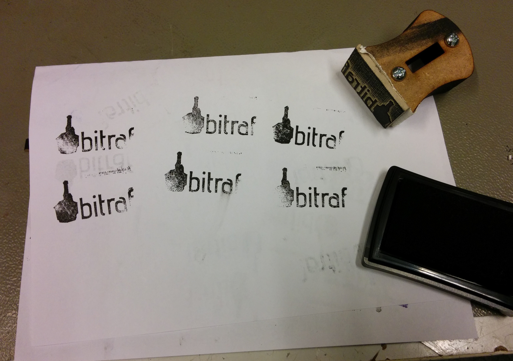

# MQTT

For connecting devices in the hackerspace, and outside, together.

## Done

* Run mosquitto
* Run `boxy4` doorlock on MQTT

## TODO

* Setup `mqtt.bitraf.no` DNS record
* Setup bitraf.no MQTT SRV DNS record
* Transition `boxy2` to use MQTT also
* Create 'interface' for doorlock, decouple from host (boxyX).
`/door/lab/open (opentime: Int seconds door is to be open)` | 
`/door/lab/isopen (status: Bool true if door is open, else false`
* Declare Msgflo participants for dlock13 devices
* Setup [Msgflo](http://msgflo.org) coordinator on bomba/users
* Have a QR/NFC code for accessing MsgFlo network with Flowhub
* Also setup pretty HTTP redirect for Flowhub live URL

## Ideas

* participant which monitors tweets to #bitraffineriet, sends out on MQTT
* participant which allows to send tweet as #bitraf-iot
* Physical device for doorlock status/opening, MQTT participant(s)

# Hackerspace stamp

Designed to use in the [hackerspace passport](https://www.noisebridge.net/wiki/passport), with overall size of 40 x 25 mm.

Lasercut rubber for the stamp surface, with lasercut MDF for the handle.

Material used was a rubber spatula [from Clas Ohlson](http://www.clasohlson.com/no/Cocraft-gummisparkel-/40-8392)

## Files

Stamp:
[Inkscape source](./bitraf-hackerpassport-fnn.svg) |
[DXF ](./bitraf-hackerpassport-fnn3.dxf)

Handle:
[FreeCAD source](./stamp-handle-laser.fcstd) |
[DXF](./export/stamp-handle-1.dxfs)

## TODO

* Add lasercut T-wedge to handle, to replace having to use M4 screws...
* Add `Oslo, Norway` to the stamp
* MAYBE: a version with `member`, and one version with `guest`?

# 3d-printer shelves

Concept

* One compartment per printer (Ultimaker Original)
* Fully enclosed when running
* Openable from the front, with drawer
* Space below/above for materials/accessories/tools/maintenance parts
* Maybe a computer terminal attached

Dimensions

* Ultimaker Original supposedly, somewhere around `X Y Z: 35.7 cm × 34.2 cm × 38.8 cm`.
* So 60 cm deep, 60 cm tall and 40+ cm wide compartments could be good.

Possible parts

* Drawer slides.
Biltema [1](http://www.biltema.no/no/Bygg/Hengsel/Ovrig/Ekspansjonsbeslag-2-stk-2000018627/)
Biltema [2](http://www.biltema.no/no/Bygg/Hengsel/Ovrig/Ekspansjonsbeslag-2-stk-2000018657/)
* Compartments box.
Ikea [1](http://www.ikea.com/no/no/catalog/products/30263660/)
ClashOlson [1](http://www.clasohlson.com/no/St%C3%A5lreol/Pr408943002)
Jernia [1](http://www.jernia.no/produkt/-/vis-produkt/fixit-hyllereol-metall-tre-180x90x40cm/58010253)
