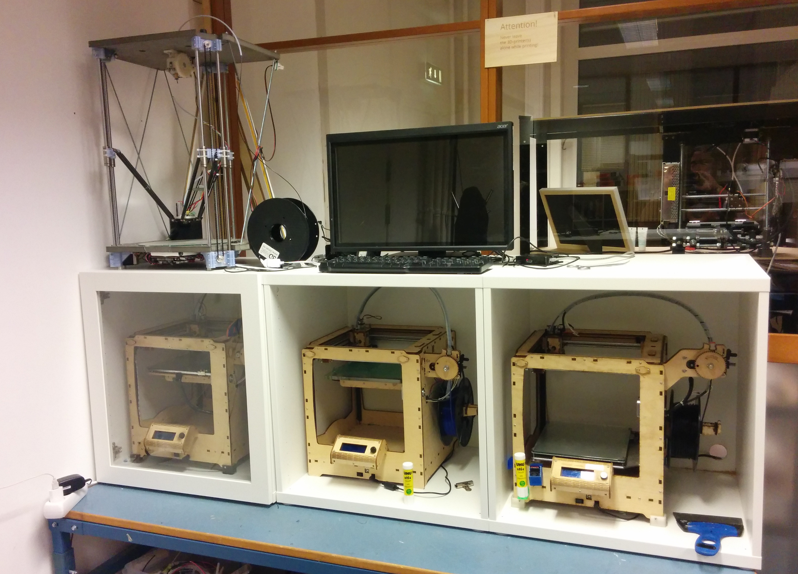

# Lasercutter

https://bitraf.no/wiki/Laser

Requires lots of maintenance work. Generally breaks once a month.

## Power supply

Says [www.jnmydy.com](http://www.jnmydy.com) and `MYO047-D`

H: high?
L: low?
P: Protection?
G: Ground?
IN: 
5V: input or output??

L~: (black)
FG: safety ground
AC: hot/neutral
AC: hot/neutral

References

* [Thourough run-though of several DC power supplies for laser tubes](http://donklipstein.com/laserapd.htm)

# MQTT

For connecting devices in the hackerspace, and outside, together.

Moved to [bitraf-iot](https://github.com/bitraf/bitraf-iot) project.

# Hackerspace stamp

Designed to use in the [hackerspace passport](https://www.noisebridge.net/wiki/passport), with overall size of 40 x 25 mm.

Lasercut rubber for the stamp surface, with lasercut MDF for the handle.

Material used was a rubber spatula [from Clas Ohlson](http://www.clasohlson.com/no/Cocraft-gummisparkel-/40-8392)

## Files

Stamp:
[Inkscape source](./bitraf-hackerpassport-fnn.svg) |
[DXF ](./bitraf-hackerpassport-fnn3.dxf)

Handle:
[FreeCAD source](./stamp-handle-laser.fcstd) |
[DXF](./export/stamp-handle-1.dxfs)

## TODO

* Add lasercut T-wedge to handle, to replace having to use M4 screws...
* Add `Oslo, Norway` to the stamp
* MAYBE: a version with `member`, and one version with `guest`?

# 3d-printer shelves

Goal was to have a fully enclosable compartment for each printer, for both sound and heat insulation.
And to be able to use the space above and below the compartments, to have space for materials/parts - and more printers.

We rotated the Ultimakers, such that the filament and extruder is on front right side instead of the back.
This provides better usability due to better access, but was also neccesary due cabinets only being 50 cm deep.
This means cutting a new hole for the display-box cables, and moving the box to the side that now faces forward.

## Parts

Following recipe from [Reprap Wilson blog](http://reprapwilson.discoursehosting.net/t/make-a-simple-ikea-enclosure/123)

* STUVA Frame - http://www.ikea.com/us/en/catalog/products/30128177/52
* SINDVIK Glass door - http://www.ikea.com/us/en/catalog/products/90291858/28
* BESTA Soft closing hinges -http://www.ikea.com/us/en/catalog/products/80261258/23

Total cost was 500 NOK per compartment.

## Possible extensions

* Add drawer slides and plate to put printer on. For even better access
Biltema [1](http://www.biltema.no/no/Bygg/Hengsel/Ovrig/Ekspansjonsbeslag-2-stk-2000018627/)
Biltema [2](http://www.biltema.no/no/Bygg/Hengsel/Ovrig/Ekspansjonsbeslag-2-stk-2000018657/)
* Replace table with 60x60 cm cabinets, with doors. Helps to organize materials.
Ikea [1](http://www.ikea.com/no/no/catalog/products/30263660/)

## Dimensions

* Ultimaker Original supposedly, somewhere around `X Y Z: 35.7 cm × 34.2 cm × 38.8 cm`.
* So 60 cm deep, 60 cm tall and 40+ cm wide compartments could be good.

# Vacum former

A vacuum former would be good addition. Especially interesting for prop-making, and mold-making for edibles like chocolate etc.

Our non-food oven can fit plates of 25x40 cm.

## Plastic plate based vacuum former

This [laser-cut design](http://www.thingiverse.com/thing:1586801) is tailored for plastic dining plates.
It also has very nice laser-cut clamps.

Material availability in Norway

* [Clas Ohlson](http://www.clasohlson.com/no/Plasttallerken/44-1435-4) D=22 cm. Polypropylene. Pink only?
* [Ikea](http://www.ikea.com/no/no/catalog/products/50192959/). Polypropylene. Multiple colors. 19 cm diameter. 2 NOK/piece
* Staples bulk. [PP](https://www.staplesnetshop.no/web/ePortal/ctrl?action=showiteminfo&itemNo=782973) [PS](https://www.staplesnetshop.no/web/ePortal/ctrl?action=showiteminfo&itemNo=885253&loc=simplesearch)

## Tool locks

MQTT-based smart locks for portable equipment. Each tool has a station that they belong at, and attached on the tool a unique key.

Electronics

* ESP8266 Wifi microcontroller board. NodeMCU / Weemos D1. 
* Powersupply 12V, 1A.
* IR led 0805, 120deg. [Kingbright kp-2012f3c](http://no.farnell.com/kingbright/kp-2012f3c/led-ir-0805-940nm/dp/2290432)
* IR phototransistor 0805, 120 deg. [Kingbright kp-2012p3c](http://no.farnell.com/kingbright/kp-2012p3c/phototransistor-0805-940nm/dp/2290434)
* Mosfet N-channel.
* Solenoid, cabinet drawer lock. 12V
[1](https://www.banggood.com/12V-24V-Electronic-Door-Lock-Rfid-Access-Control-for-Cabinet-Drawer-p-1011146.html)
[2](https://www.banggood.com/12V-DC-Cabinet-Door-Drawer-Electric-Lock-Assembly-Solenoid-Lock-27x29x18mm-p-1048590.html)

