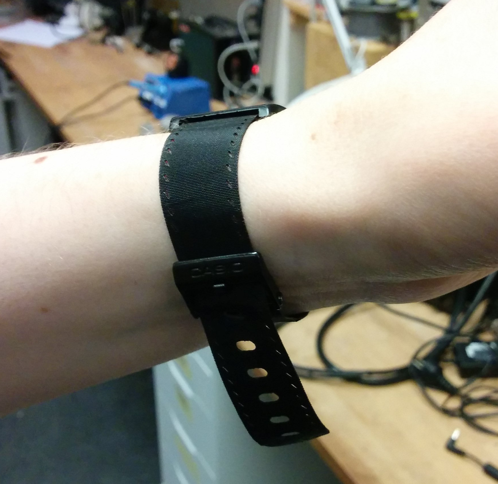

# Clothing

All files here, unless noted otherwise, are released under [CC-BY](http://creativecommons.org/licenses/by/4.0/).

# Designs

## Textile watchband

Designed for laser-cutting. Key ideas:

* Using a fold of doubled fabric as connecting loop, for strength
* Using laser to fuse synthetic fabric, to avoid fraying edge and sewing

Made in collaboration with [Annika Rockenberger](http://www.annikarockenberger.com/).

Process:

* Take a piece of Polyester, or similar synthetic textile
* Optional, recommended: Use gluestick PVA/like for paper, on the fabric, to ease folding
* Fold it over to make a loop, pressing the two sides firmly together
* Tape the textile onto a piece of wood, stetched out evenly
* Load the DXF file, position the pieces with fold/watch-side aligned vertically
* Run the job such that the origin is slightly before the fold. This to avoid cutting off the fold
* Open up the fold, insert here pins and attach to watch
* Attach clasp by putting pin through stitch holes (other end of short piece)

We had best fusing results when moving the laser slightly out of focus (13.5 mm instead of perfect-focus 10.5mm),
and when having air-assist turned off. On our Redsail 60w laser, we used 30 mm/second speed and 3% power.

Made for a Casio digital watch, but can be adapted to most watches. Length is parametric in the source files.
We reused the existing clasp, but one can probably 3d-print one.

## Ideas

### Retrofitted personalization using digital fabrication

Having personalized clothing is tricky&expensive when buying from niche stores,
and creating things from scratch is time-consuming & skill-intensive
due to lack of widely available automated fabrication of clothes.

So instead, lets try to "hack" 'standard' clothing to become more
inline with a personal/niche style, using modern & accessible digital fabrication tools
like the 3d-printer and laser-cutter.

Falls into existing traditions of clothes modding, for instance by punks in the 80ies.

But with a focus on designs which can be easily reproduces across the world,
using standardized tools&material. The existing pieces of clothing become 'vitamins'
(in the Reprap terminology), and should be source-able locally from generic stores.

### Gothic ideas

I am particularly fond of 'gothic' style clothing.
Typical characteristics are

* Dark, monotone colors. Predominantly black. White sometimes as contrast.
Blood-red or burgundy/velvet sometimes used.
In some cases, muted earthy colors are used a little bit: brown, greens.
Notable exception is cybergoth, where near-neon blue/green/pink is used as accent.
* Particular materials: Velvet, leather, .
Modern variants sometimes (shiny) plastic/rubber/latex.
* Jewelry and details usually silver/steel/tin-look
* Fictional themes include, Vampires, (dark) angels, witches, occult, dragons
* Historical themes include, Victorian
* Nature inspirations: Crows, spiders, bats, snakes.
* Symbols: Bones, skulls, crosses, heart,
* Paricular accessory items: Cane, pocketwatch, gloves, tophat, umbrella
* Sometimes crosses with: Punk, steampunk, bondage/SM, folk/pagan

Items one could hack on existing clothing to gothify it:

* Straps
* Buttons
* Chainrings / chains

### Technique ideas

* Lasercut holes in one side only,
by placing a hard-to-cut material inbetween (wood etc). For instanace into a sleeve, leg or body of tshirt.
* Print pieces two-sided, a visible front-piece and a backing which goes on inside of cloth.
Have the two pieces snap into eachother, glue or sew together - embedding the cloth in it.
* Design in holes/loops in pieces to be attached, which thread can easily catch from inside.
Can be either be hidden, or visible, possibly with intricate patterns with a colored thread.
* Use lasercutter to etch patterns, by removing (existing) dyes.
Maybe one can also using some activation chemical for coloring, similar to metal-etch paste?
* 3d-print positive and negative, use to emboss foil/sheets parts. Tin, copper etc.
* 3d-print, conductive material or pant -> electroplate with silver

## Utilitarian ideas

Not as in 'utility instead of beauty' but '*utility as beauty*'.
Where the function of the piece is primary, and embelishment are secondary or tertiary.

Consider for instance items usually carried on ones person, like:
Money/creditcard/keys/id and a mobile device.
Some also carry beautification items,
and some carry tools of their trade (carpenters/electricians etc).

For these there are both security (making sure items are not easily lost or stolen),
and accessibility considerations (items must be easily found and retrieved).

Ideas:

* Credit-card or mobile-phone holder in sleave, or as bracers.
Could be a quick-release, magician style - that one can flick open.
If using non-contact payment systems (NFC etc), the card does not even need to come out.

### Fictional/Fantasy utilitarian

Nothing says utilitarian in fashion needs to be for this universe.
Imagine alternative universes, and how they might influence clothing:

* World without prevalent lighting, needing to carry personal lighting. Underground/post-apocalyptic etc.
* Water- or underwater-world.
* Living in trees/canopy.

Perhaps every item could tell a story of the universe it belongs to,
and the kind of person wearing it.

## Fashion is Facism

I am of the opinion that

    Modern-day 'fashion' is a facism driven by coorporations,
    trying to control what people wear in an attempt to make (more) money,
    playing off peoples want/need to associate with tribes or classes,
    and fear of not being acceptaled.

# Automated production machines

Open source

* Linear knitting machine.
[Knitic](http://www.knitic.com/),
[OpenKnit](http://makezine.com/2014/02/27/openknit-an-open-source-knitting-machine/)
* Circular knitting machine [Circular Knitic](http://www.knitic.com/2014/12/27/circular-knitic/)
* Pattern-making software [Valentina](http://valentinaproject.bitbucket.org/) [KnitWeb](https://github.com/fashiontec/knitweb)
* Communities
[FashionTec](https://fashiontec.wordpress.com/)
OpenSourceEcology [wiki](http://opensourceecology.org/wiki/Clothes) [discussion](http://forum.opensourceecology.org/discussion/563/textiles-and-clothing/p1)
[OpensourceTextiles](http://opensourcetextiles.org/)
* Jacquard loom [osloom](http://www.osloom.org/)
* Embroidery machine mod (XY stage) for existing sewing machine.
[Openbuilds](http://www.openbuilds.com/builds/embroidery-machine-with-xy-belt-and-pinion-drive.691/)
* Spinning machines. [Electric Eel](http://www.electriceelwheel.com/wp/)

Existing in industry

* Pocket attachers. Manual loading. [video](https://youtu.be/oaOtX1btpUM?t=75)
* Pattern/programmale sewing machine. [4-axis](https://youtu.be/r7HhCmeCIy8?t=72) [2-axis](https://youtu.be/c9YANXdc_DY?t=102)
* Industrial loom [how it works](https://www.youtube.com/watch?v=TyhDkd8Iabs)

# Automated industrial loom

For use with locally sourced material. For instance (in Norway), wool and linen.
Focus on ability to make clothing, or technical textiles. Decorative secondary, for now.

References

* [Lego small mechanical loom](https://www.youtube.com/watch?annotation_id=annotation_215425851&feature=iv&src_vid=i6RJN3l6q4w&v=WC6wM_XsWO4)

## Heddle movement (shaft)

Motion: 
Shape of heddles can be digitally fabricated (printed/lasercut).
Altenatively, one can use a (preferably metal) loop to form the 'eye', attached with string at top+bottom.

## Weft insertion

When using a rapier, also need scissors to cut the weft thread after insertion.
With a flying shuttle this is not needed, as the thread loops back, and the weft is essentially continious.

References

* [Youtube: Types of weft insertion](https://www.youtube.com/watch?v=s0W0iDj7_hc)
* [Thingiverse: Simple rack&pinion OpenSCAD](http://www.thingiverse.com/thing:172508/#files)

## Weft pull

Reed needs to be very fine for fine textile. Often steel profiles are used.
For coarser weaving, should be digitally fabricatable. Could for instance make the reeds fairly deep,
like those used for projectile-based weft insertion. Depending on required

TODO: find out what weft pull is required

Motion: 

## Warp/cloth rollers

The warp threads come from bobbins, over a roller to guide and maintain tension.

TODO: find out typical warp tension

## Motion syncronization

Each of the mechanical parts must act in unity with the others if the machine is to work reliably.
Can be done entirely mechanically. Advantage is only needing a single motor,
disadvantage is many complex parts in motion, and dependencies between sub-systems.

## Solenoid for Jacquard loom

Individual control over heddles on a Jacquard loom, requires a cheap/reproducable device.
Since only two states (up & down) are needed, can use a solenoid.

References

* http://www.hydraforce.com/electro/Elec-pdf/3-440-1.pdf
* http://hyperphysics.phy-astr.gsu.edu/hbase/electric/indsol.html
* http://www.qsl.net/pa2ohh/jslcimp.htm
