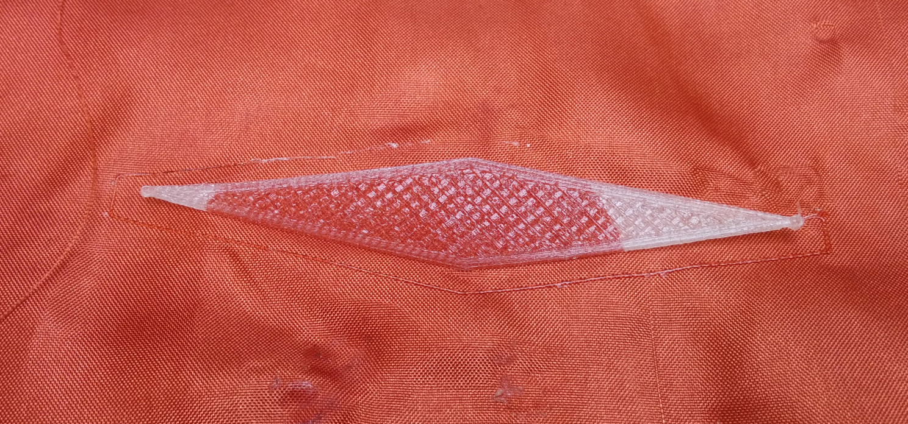
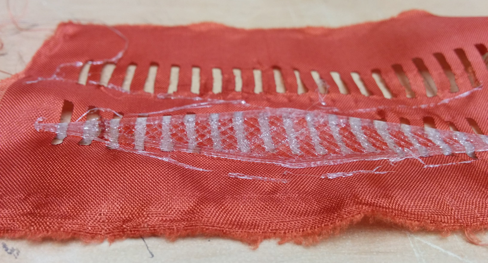

# Configurable flexibility in 3d-printing

Use the geometry to create different material properties in
flexible or semi-flexible materials such as NinjaFlex.

## Voronoi infill for Cura

We've developed a way to let your CAD software specify the infill pattern
of your 3d-printed object. This is done as a special version of CuraEngine,
the slicer in Cura.

Branch: https://github.com/jonnor/CuraEngine/tree/flexible

# Potential Applications

## Printed shoes

Possible production process

* Laser cut or drag-knife textiles for upper sole
* (possibly) Apply bonding agent
* Put textile into FDM 3d-printer, print lower sole using NinjaFlex

Refererence

* http://3dprint.com/83277/3d-printed-footprint-footwear/
* http://www.demilked.com/japanese-inspired-wrap-around-shoes-furoshiki-vibram/
* http://www.zappos.com/measure-your-shoe-size. Mens size 40 is 244mm, 42 is 260mm

# Tests

## Bonding NinjaFlex to cotton

Printed NinjaFlex directly on cotton that was
stretched out on printbed (fastened with electrical tape).

Manually adjusted the Z-level height by observing first layer.

Print adheres nicely to cotton during printing. No indication this would not work well in large scale.

After removing print, NinjaFlex adheres OK to the cotton. At 1mm thick, it follows the fabric quite easily.
'Peeling' forces between the two will easily cause it to separate however.
 
Using UHU stick glue on the cotton improves adhesion both during print and afterwards,
but does not significantly improve resistance to peeling.

## Thermalbonding NinjaFlex to synthetic fibres

If the melting point is ~200 degrees, might be able to fuse the materials together.
This will form a much stronger bond than gluing.

* http://www.engr.utk.edu/mse/Textiles/Polyester%20fiber.htm suggests polyester fiber has ~250 deg C melting point.
* http://www.swicofil.com/polypropylene.html suggests that polypropylene fibers have ~170 deg C melting points.
* https://www.huvis.com/eng/product/prod_info.asp?num=&f=21&s=4&t=50&p=109 suggests that a range of 'low melt woven fibres' exist, with melting points 110-200 deg C.
* http://cameo.mfa.org/wiki/Acrylic_fiber

A couple of tests fabrics were gotten at a local store, one "100% polyester" and one "polyester/nylon".
The second material we were able to melt by pressing against the printer nozzle.

Attempted to thermobond by setting heatbed to 70 degrees, hotend at 235 (15 higher than normal for NinjaFlex).
The resulting bonding was significntly better than for cotton, but there was no 'fusing action' - and the
bonding is still relatively easily peeled off.

## Multi-part print to improve bonding

Could then bond NinjaFlex to NinjaFlex, side-stepping issues of bonding to textile.

* Print bottom part
* Cut textile, including some holes for NinjaFlex to come through
* Put textile into printer, on top of bottom print
* Print upper part, bonding to lower through holes.
* Effectively: embedding the fabric into the print

Major benefits are that this is super-strong, and can be done with any textile material.

# Ideas

* Test a NinjaFlex+fabric shoe design. Possibly downscaled

## Embedding textiles in 3d print

Example of a combined additive+subtractive digital fabrication process.
Textile can be lasercut or cut with dragknife.

Braindump. 

Possible properties

* Strength. Fibres in textile stiffness of PLA/ABS
* Shock absorption and grip/friction of NinjaFlex
* Texture/pattern. Using textile to avoid or combine with typical FDM texture
* Replace stitching with 3d printed seams.
* 3 dimensional structure in clothing
* Using conductive filament for active wearables
* 'Textile' could also be paper. Or fibreglass/carbonfibre. Epoxying later?

# References

Work by others

* 3d-printed metamaterials creates flexible machines. Using structures designed for controlled shearing
[Make](http://makezine.com/2016/09/14/3d-printed-metamaterials-create-flexible-machines/)
[Research paper](http://alexandraion.com/wp-content/uploads/2016UIST-Metamaterial-Mechanisms-authors-copy.pdf)

