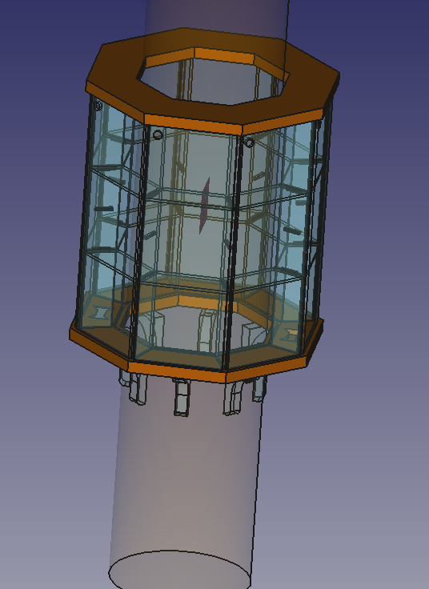

# Lyngen

An octagonal display case, designed for mounting around a column
- in particular the huge Norway spruce that bears the roof of [MIT Fablab Norway](http://www.fablab.no/) in Lyngen.

Concept by Haakon Karlsen, modelling & fabricated by [Jon Nordby](http://jonnor.com), with help from [Jens Dyvik](http://dyvikdesign.com).

## Materials

Top & bottom parts were milled in 27 mm wood used for benchplates, but any wood with thickness >18 mm should work.
The vertical panels are designed for 5.7 mm acrylic, but 6 mm should work without redesign.
By changing the parameters in the source files, can adapt to approx 5-8 mm.

## Sources

[FreeCAD project file](./lyngen.fcstd) |
[DXF lasercut parts](./export/lyngen-lasercut-1.dxf) |
[DXF milled parts](./export/lyngen-milled-1.dxf) |
