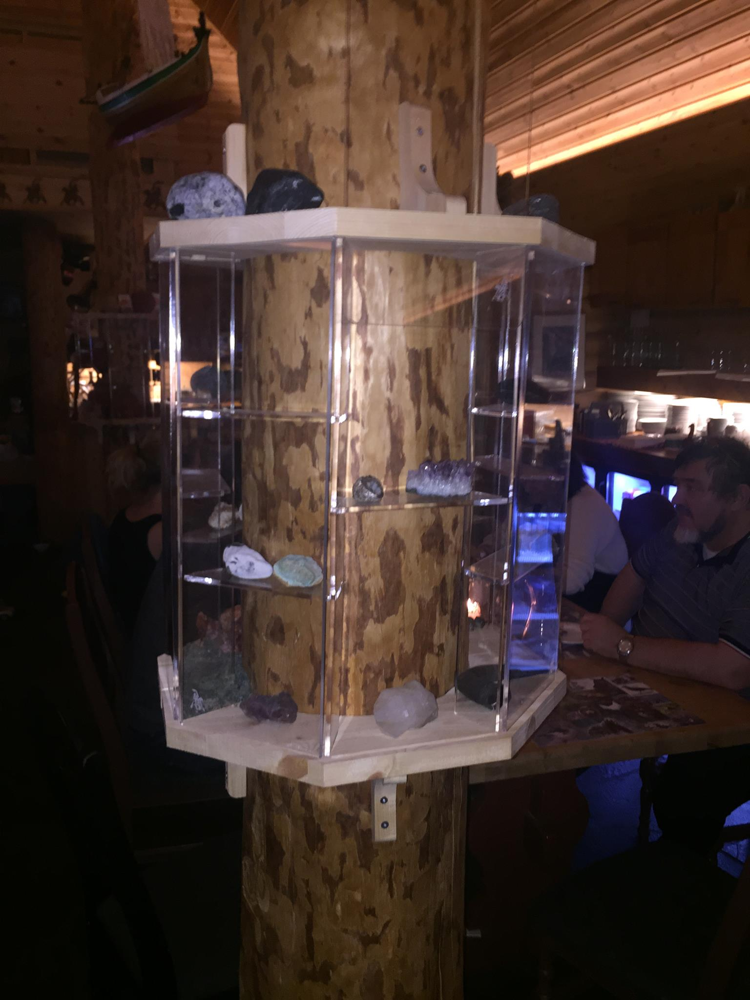
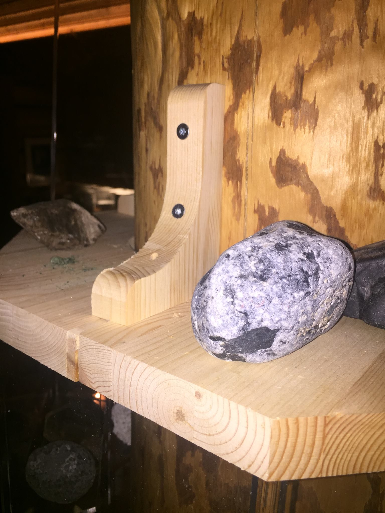

# Lyngen

An octagonal display case, designed for mounting around a column -
especially the huge Norway spruce that holds the roof of [MIT Fablab Norway](http://www.fablab.no/).

Concept by Haakon Karlsen, modelling & fabricated by [Jon Nordby](http://jonnor.com), with help from [Jens Dyvik](http://dyvikdesign.com).
First version made in Lyngen, after Nordic Fablab basecamp, January 2016.
In March [Siemen Cuypers](http://www.siemencuypers.com/) adapted, CNC-milled and outfitted each of the columns of the fablab.

## Materials

Top & bottom parts were milled in 27 mm wood used for benchplates, but any wood with thickness >18 mm should work.
The vertical panels are designed for 5.7 mm acrylic, but 6 mm should work without redesign.
By changing the parameters in the source files, can adapt to approx 5-8 mm.
Glass instead of acrylic can be used for the front, and vertical panels could be wood (plywood or MDF) instead of acrylic.

## Sources

DXF parts are made for a circular central column between 800-1000 mm circumference.
Adapt the parameters in the design for different sizes.

[FreeCAD project file](./lyngen.fcstd) |
[DXF lasercut parts](./export/lyngen-lasercut-1.dxf) |
[DXF milled parts](./export/lyngen-milled-1.dxf) |

Without too much work, the model could be adapted to mounting against a flat wall -
cut off and add a slot along the backside.

## How to build

### Make parts

* CNC-mill: 2 halves for top plate, 2 halves for bottom plate, 4 butterflies, and 4-8 brackets.
* Lasercut or mill, 8 side-walls
* Lasercut or mill, 8 back-walls
* Lasercut or mill, 12 shelves
* (optional) Lasercut or mill, 8 front windows

To be able to slide the front window out, the top plate groves should be cut all the way through (versus ~50% for bottom slots).

### Assembly

* Assemble the vertical panels to each of the bottom halves.
* Attach the brackets to the central column
* Move the bottom plate halves onto the brackets (second pair of hands useful here).
* Use the butterflies to connect the two pieces of bottom plate. Fasten the butterfly with short screws. 
* Slide the two halves of the top plate down onto the vertical plates.
* Use the butterflies to connect the two pieces of top plate. Fasten butterfly with short screws.
* (optional) Slide in front windows, through the top slot
* Attach bottom plate to brackets using screws, or use three-four wedges to prevent sideways motion.
* (optional) Use 2 brackets to fasten top plate to column, or add two wedges to prevent sideways motion.

## Pictures

# QR description tags

Moved to [doctags project](https://github.com/jonnor/projects/tree/master/doctags)

