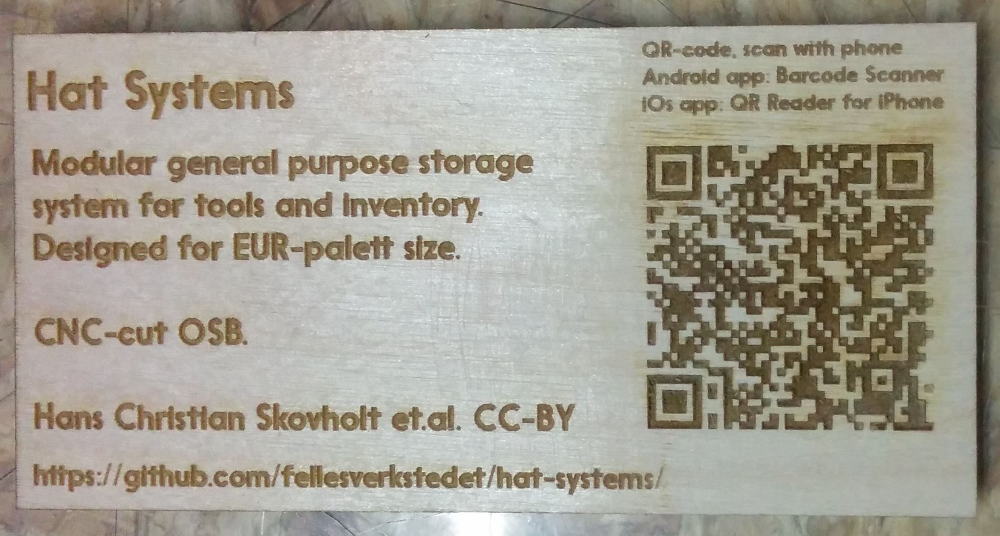
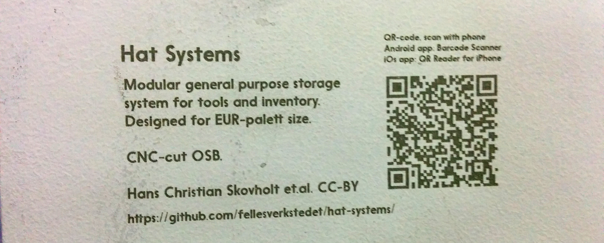
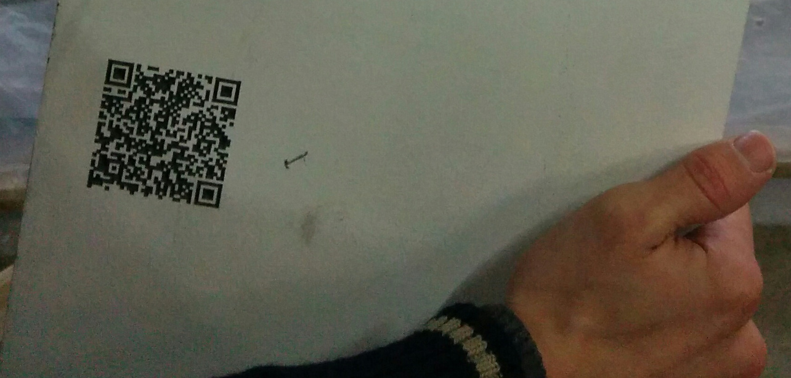
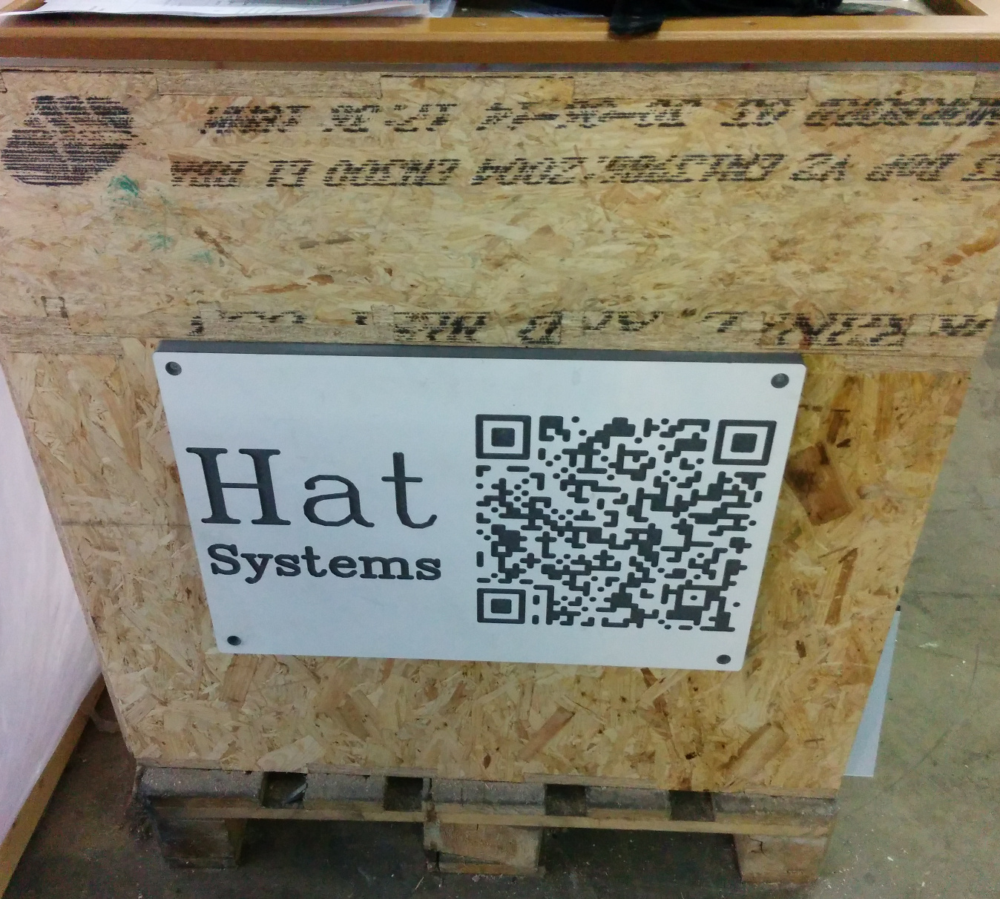

# QR description tags

We want to have a physical description tag, which is linked to online documentation for more information.

[Example QR doc template](./img/qrdoc-template.png)

This allows viewers to quickly get to the story behind the object,
and for digitally fabricated objects, to the files needed to reproduce it.

If you are deploying this in your space, also consider providing a device which have a QR code reader included,
for instance an old smartphone and tablet. This allows people to scan without needing to
have a smartphone with installed app. Sadly QR-code apps, and user knowledge, is not that common yet...

## How to create new tag

[SVG template](./qrdoc-template.svg). Recommended print size: 80x40 mm

To create a new one:

1. Put your documentation online, with some URL
2. Generate a QR code for the URL, ex using [online tool](http://qr-code-generator.com/)
3. Open SVG template in [Inkscape](http://inkscape.org/)
4. Replace the URL, description, medium and QR-code with your data
5. Print out, or laser-engrave the label
6. Place onto object, or where object is displayed

## Ways of fabricating the tag

Basically any way of doing a 2-color detailed logo with good contrast will work.
Eacn technique will have a particular look, and advantages/disadvantages when fabricating.

### Printed label

Print a label with 3d inkjet/laser-printer. Onto paper or transparent.
To make more permanent and durable, fix the label onto fabricated object,
then coat with transparent paint or varnish.

### Laserengraved wood

Simple and effective with light-colored wood.
You may need to use extra high power to get things dark enough.
Then you can either use masking-tape to prevent 'flaring' on the light areas,
or you can sand down the top a bit afterwards.

### Selective paint removal with laser

Surface was first painted, then selectively removed with lasercutter to reveal color underneath.

### V-carving painted surface

Can also invert and instead have dark paint, and mill carve out to reveal the light parts.
Or one could use a clearance tool, to leave pieces standing out of material
with the other color on the tops.

### Milling with endmill

6mm end-mill is common to use for large-scale work in ply/wood/OSB/MDF.
When using this also for creating the labeling, no tool change is needed
and there is very little extra time spent.

Our unoptimized QR-code with 6 mm bit was around 25x25 centimeters.
It took around 6 minutes to mill on a Shopbot, at 60 mm/s, 2 mm depth and 2 mm safe-Z.
Description text was hard to fit because the stroke-font had too tight letterspacing.
On 50 cm one can maybe fit 40 characters. This makes a short URL very desirable.
If the required size is too big to fit intended design, it is better to change
to a smaller endmill (like 3mm), or use V-carving.

To not have to paint the surface in advance, one can mill with a masking tape or adheasive paper on.
Afterwards one paints, and then peal of the mask. This will leave color only in the milled gaps.

### Other methods

* Cut-through one layer of material, to expose another layer of different color.
* Etch pattern, then paint surface, then sand away to leave paint only in etched areas. Good for metals.
* 3d-print, with black or white being raised or lowered from surface.
Then paint either top or bottom parts in opposite color.
* Using geometry and a lightsource instead of multi-color materials.
Either by casting shadows, or active back/front-projection.
* Phototransfer
* Silk-print

## Designification

Ways of integrating the tag into the design of object

* Having binary textures around/spreading out
* Putting it in a less prominent, but still visible location
* Putting it in a hidden location, like underneath or behind

## Related

* [Introspectable objects](https://github.com/jonnor/random/blob/master/digital-fabrication/introspectable-objects.md)

