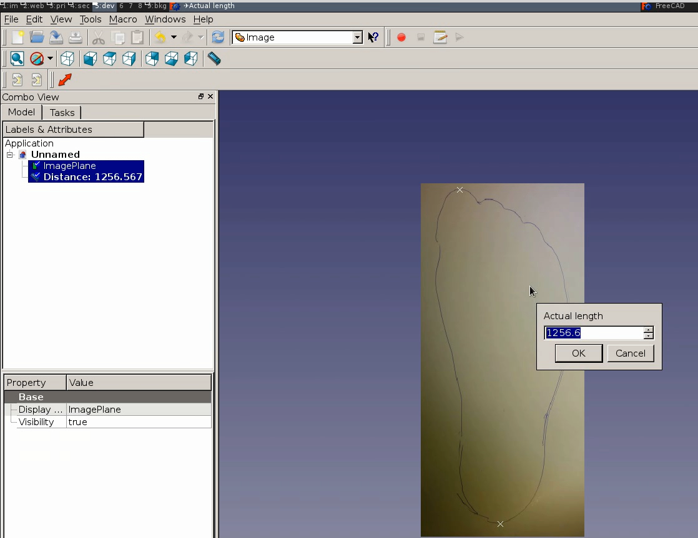

# FreeCAD tools & learnings

[FreeCAD](http://freecadweb.org/) is an excellent open source parametric solid modelling CAD software,
which I use for almost all my modelling. Here are some tools, tips & tricks that I've developed.

## Macros

## Image scale to reference

When you import an image into 3d-view using a ImagePlane, the image is sized based on DPI x pixels.
If the image is a photograph of an object, this is unlikely to be the correct physical length.
The [imageScaleReference](./macros/imageScaleReference.FCMacro) macro lets you *scale image
by specifying the distance between two points*.

Very useful when working with images as references, to trace complex curves,
design something that fits or interfaces.

Usage:

1. import Image Plane
2. Create Measurement between two points
3. Select ImagePlane and Measurement
4. Execute macro, and insert actual/real size.

[Youtube demo](https://www.youtube.com/watch?v=feM51aIdLGo)

## Export project

Exports all files in document which has names like `mypart [dxf]` or `thing [stl,step]`
to individual files in a export directory. Default prefix: 'export/$project-'
Can be ran both as a macro from the FreeCAD UI and as a script on commandline.

Download: [exportProject](./macros/exportProject.FCMacro)

This allows treating the FreeCAD file as a single-source-of-truth,
and to automate the tedious and error-prone task of updating derivative/exported files.

After having annotated the FreeCAD file, run the macro from the FreeCAD GUI.
Or you can use the commandline:

    python2 exportProject.FCMacro myfile.fcstd

## Tools

* RML-format CAM post-processor, [for Roland MDX](https://github.com/FreeCAD/FreeCAD/blob/master/src/Mod/Path/PathScripts/rml_post.py)

## TODO

* Test wether FreeCAD macros are picked up when in subdirectories
* Create separate repo for FreeCAD macros
* Maybe also add custom workbench setup?

# Common issues

* Cannot unset the support of a sketch in UI (only map it to somethingnew). Needed when refactoring.
Expected: This would be a editable property under 'Data' listing.
Workaround, use Python console. Copying into a separate project, then copying back might also work.
* Accidentially
* Leaving an editing action open, bunch of . Problematic because it is invisible, on other tab behind.
Better: 

## Ideas

### Continous integration for CAD

Continious integration (CI) is a best-pratice in software development. A CI system picks up
very change made to source/project files in a shared revisioning system (like git).
It then runs a bunch of automated tasks, including verification, documentation generation.
If all checks pass, and - publishes the results to an accessible place online (intra/internet).
It helps in keeping quality up because all the tedious (and error-prone) aspects of quality assurance
and publishing are automated.

What would such a workflow look like for CAD?
Particularly one centered on open source digital fabrication?

And overall flow could be like this:

* Check in changes in git, push to something like Github
* A CI service, something like Travis picks up the changes
* Export individual artifacts from the project sources.
3d-models, renders/previews (images/interactive), fabrication data (CNC/laser cutsheets), assembly drawings.
* Generate documentation from sources + other descriptions.
Webpage(s) describing the model/project, including links/embedding exported artifacts.
* Verifies that the outputs are good.
Individual models checks like watertightness, etc.
Checking project-wide constraints like stable 'interfaces' of parts, assemblies fitting together, maximum material or cost budgets.
FEM analysis.
* If checks pass, publishes/deploys the results.
To local website, but also to sharing services like Thingiverse/Youmagine or production services like Shapeways/Ponoko/Sculpteo

#### Export
See 'export project' macro

* TODO: allow exporting preview, both 2d-image (PNG) and 3d interactive (HTML5)
* TODO: integrate with CAM support, for directly exporting machine code
* TODO: allow to create variations on the same part.
Could work by having the 'exported properties' defined in a spreadsheet (FreeCAD 0.16+).
Then for each variation have its own column, with a cell of overidden values.
Script would then apply each variation (and reset back when done), export file(s).
Can maybe infer name from the properties/values, or allow a variation/name column

#### Web-based parametrization

OpenSCAD on Thingiverse has a nice feature 'Customizer', where one can change exported parameters
and get a custom ready-to-print .STL out, without having to download any tools.
We should have the same for FreeCAD.
Could for instance look for a spreadsheet or other specially-marked object with the properties.
Might also have tags to annotate if a property should be hidden, grouping and data-type, description etc

Need to be able to find such properties in file, and build up webui for it.
Then when user decides on parameters, add job to queue for creating the files.
And then actually generate them, upload and notify user of results.

Can be built on top of the 'Export Project' macro/script.

* Should be able to export any format.
Like .STEP for refencing in any 3d-software, and .DXF for lasercutting/CNCing
* Should be able to export multiple files

MsgFlo workers/queueing. IPFS-first storage? Docker on Heroku deploy?

Allowing arbitrary Python scripts is desirable long-term, but is tricky for security reasons.

#### Automillling

* TODO: Make a post-processor for Shopbot.
Seemingly only needs to replace spindle start command in the gcode?

#### Autolaser

* Make a post-processor for HPGL dialects like Epilog/GCC/Universal.
* Make a post-processor for g-code dialects like grbl/Marlin. M106
* Button for sending HPGL to printer device
* Support a tool type "laserbeam". Can hold properties like power/air-assist
* Automatically generate toolpath operations for objects. 
Chose which objects to be included. Default to everything within machine area.
Start with things only needing cutting.
Should automatically do inside-out cutting.

#### CAM integration

* Have a save-to-file for gcode, that goes via post-processor. If not existing already??
* FreeCAD: Selecting integrated post-processors should be a dropdown
* Button for sending g-code to Octoprint (and start)
* Tool/macro for lay-flat/set Z-direction. Automatically put with thinnest part up
* Tool/macro for autolayout/nesting

#### Documentation generation

* TODO: generate links/embeds to exported artifacts, as Markdown
* TODO: tool for merging this with human-written Markdown about the project.
Alt: Extract title/description etc from FreeCAD file.
* TODO: test building resulting Markdown with a static-HTML website-builder like Jekyll

#### Testing, Verification

* TODO: research existing methods, best-practices, available open source tools

#### Publishing

* TODO: Script for publishing to Thingiverse, Youmagine, etc
http://www.thingiverse.com/developers/rest-api-reference
https://www.youmagine.com/api
* TODO: Also support publishing to Shapeways/Sculpteo/Ponoko
http://developers.shapeways.com/
http://www.sculpteo.com/en/developer/webapi/
http://www.ponoko.com/app-gateway/api-documentation

The script should allow 'syncronizing' a new version, not just publishing new things once (to get fixes etc in).
This could be done by embedding (and reading back) some sort of object id.
Could be any unique string, but a UUID would do fine unless manually specified.
Releasing a new thing would then imply changing the object ID.

Should link back to website as the canonical home of the project.

#### CI integration

* TODO: make the tools easily installable
* TODO: document how to set up on Travis CI

#### Related

Related work

* [Fellesverkstedet Fablab documentation guidelines](https://github.com/fellesverkstedet/documentation)
* [Documentation is futile, make machines do it](https://gist.github.com/jonnor/33f5bf53646fab84bb2d)
* [Machines that document](https://github.com/jonnor/random/blob/master/digital-fabrication/machines-that-document.md)
* [Introspectable objects](https://github.com/jonnor/random/blob/master/digital-fabrication/introspectable-objects.md)

## Wanted

### Creating joinery.
Tools/scripts for creating everything from simple dowel+hole/mortise+tendon, finger-joints and cross-laps.

* https://en.wikipedia.org/wiki/Woodworking_joints
* http://www.core77.com/posts/43001/Reference-The-Ultimate-Wood-Joint-Visual-Reference-Guide

Related to below idea about sectioning models, as in that case joinery could be automatically made.
Related to Daniel. working on scripts for doing living-hinge type things.
Look at how people do this in advanced tools like Rhino/Grasshopper, AutoCAD etc?
[FreeCAD forum discussion](http://forum.freecadweb.org/viewtopic.php?f=8&t=13023&p=104266#p104266)

### On-canvas labelling of parts

A good 3d-model is useful for illustrating a concept.
But to make it really understandable, would be nice to be able to have text labels pointing at the individual parts.
Could use the names of objects. Needs no extra UI and encourages good naming.

Related, it could be desirable to name a constraint, and show that name as well.
Especially for parametric models that are designed for customization.

### Unrolling a sketch line

For use with PathArray where one is a complex geometry, and
one is the same just linear. Should update length of linear line to match sketch geometry.
Maybe related: http://www.freecadweb.org/wiki/index.php?title=Macro_unrollRuledSurface

### A parametric/connected 'cross-section tool'.
Currently the Part::CrossSection creates a copy which is not updated on changes to the part it comes from.
I often used this for DXF export (for lasercut/milling). Then it is irritating (and error-prone) that
it does not update...
Especially because the object also needs to be rotated (to XY plane) and moved (to avoid overlaps), each time.

Draft::Shape2dView does update, but often gives not the results wanted.
For instance, duplicate lines projected etc. Also a bit trickier/not-so-nice to use, due to bad preview.

Internally Part::CrossSection uses `myobj.shape.slice(plane, height)`, and puts the results into a Compund path.
Should be doable to create a parametric tool in Python using the same.
Base object should be selectable, as well as cutting plane (default=XY) and height (default=mid).
Would be convenient if it also has option for output rotation (default=XY), then cutting plane can default to across-thinnest.

Would be great if the tool produced output that was openable in FreeCAD also without the tool installed,
that it would just be non-parametric CrossSection.

### Stitching path-effect

For creating stiched lines, for creating lines where piece should bend.
For instance using lasercutter in materials like cardboard, thin plastics
Kinda related to sheet-bending workbench.

Right now doing this with a sketch, and Draft::CopyAlongPath.
It is pretty nice, but it can only follow one path, which is quite tedious.
One also need to calculate the number of items using expressions, also tedious.
`count=(targetlength)/(stitchon-stitchoff)`

### Dogbone/t-bone operator

When milling internal shapes that are required to be at least as big as geometry, must use
dogbone/t-bone to compensate for the radius of the milling bit.

Similar to ordinary fillet in operation: Select edges to work on, set radius.
Should be a parametric operation, with radius as changeable property.
Ideally should be able to select an edge loop as well, and have all the corners automatically fixed.

### Live-coding
For tools / advanced models

CadQuery and its FreeCAD plugin looks promising.

* https://github.com/dcowden/cadquery
* https://github.com/jmwright/cadquery-freecad-module

## Learning material

By others

* 1 - Basic - Design a Knob - https://vimeo.com/158161787
* 2 - intermediate - Design a Box - https://vimeo.com/158928871
* 3 - Advanced - Design a Ketchup Bottle - https://vimeo.com/203816107

## Learned

Rebasing part features
----------------------

Sometimes one changes a feature that other part features depend on,
for instance adds chamfer/fillet to a flat geometry. This operation
creates a new object, but existing geometry still references the old object.

Can be done manually in the Python console.
Use `Tools -> Dependency Graph` to see existing relationships.

Challenges is that different operations
Here are some 

    .Shapes = [new]
    .Objects = [new]
    .Base = new

TODO: create a macro which can do this?

Needs to take the old object and the new objects as input.
(rebase everything that depends on it)
Should be an undoable operation as it probably does not work in all cases...

Partitioning/sectioning/tile model
------------------------

Sometimes one would like to split up a model
For instance to create composite objects which are bigger than available printer build volume,
to use multiple printers in parallel or to keep time of individual jobs down.

Example use is for hollow objects which will be coated with glass fiber, like foils/wings.

Can be done manually by creating a set of `Cube` and using `Intersection boolean` for each tile.

Macro in progress

    import math

    doc = App.ActiveDocument

    target = Gui.Selection.getSelection()[0]
    assert(target)
    bounds = target.Shape.BoundBox

    # TODO: accept size from GUI?
    # TODO: consider size only as a maximum
    size = (60, 60, 60)
    origin = (bounds.XMin, bounds.YMin, bounds.ZMin)
    tiles = (int(math.ceil((bounds.XMax-bounds.XMin)/size[0])),
	         int(math.ceil((bounds.YMax-bounds.YMin)/size[1])),
	         int(math.ceil((bounds.ZMax-bounds.ZMin)/size[2]))
    )

    # TODO: make tiles be symmetric to centerline of object?
    # TODO: export as .stl files for 3d-printing (or wirecutting/milling)?

    objects = []

    for tx in range(0, tiles[0]):
	    for ty in range(0, tiles[1]):
		    tile = doc.addObject("Part::Box","Box")
		    tile.Height, tile.Width, tile.Length = size[0], size[1], size[2]
		    tile.Placement.move(App.Vector(origin[0]+size[0]*tx, origin[1]+size[1]*ty, origin[2]+0))
		    common = doc.addObject("Part::MultiCommon","Common")
		    common.Shapes = [tile, target]
		    objects.append(tile)
		    objects.append(common)

    group = doc.addObject("App::DocumentObjectGroup","Group")
    group.Group = objects
    group.Label = "Tiles of " + str(target.Label)

    doc.recompute()

Should take object, origin/start of the grid,
the axis to lay out grid across,
and size/number of partitions.

Plane could default to XY/ZY
Origin should default to lower left in plane

In simple mode could just select object, (max) size for a tile,

Considering structural strength of parts
------------------------------

For 3d-printing, direction when producing matters a lot.
Having a visualization of the intended printing direction,
and thus the layer direction.

Rules of thumb

