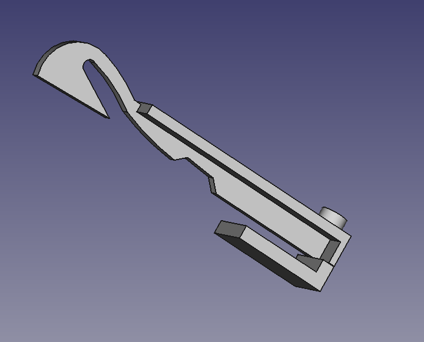
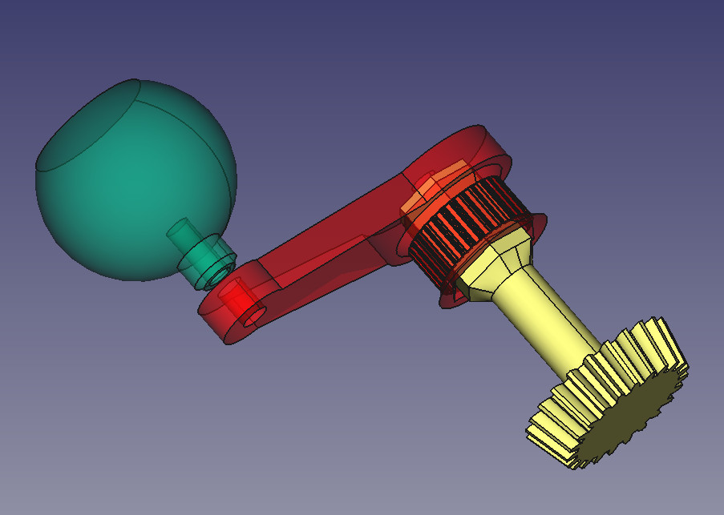

Idda: A circular knitting machine
==================

Reverse engineered from modern circular knitting machines made from injection-molded plastic,
like the [Addi Express](https://www.google.no/?#q=addi+express).

Features

* 22 or 46 needle. 
* Can create circular and rectangular swatches (using back-and-forth knit)
* Max swatch for 46 needle: 17.75 inch
* Manual cast-on and bind-off
* Manual forwarding

Motivation

* Be able to replicate using distributed digital manufacturing (3d-print/CNC)
* Be able to customize. Different number of needles, needle/mask size, adapting to different materials, adding automation

Status
--------
**Paused**

The [Circular Knitic](http://www.varvarag.info/circular-knitic)
[(Github)](https://github.com/var-mar/circular_knitic)
[(docs)](http://issuu.com/marcanet/docs/circular_knitic_documentation)
is an open source functional implementation of the same mechanism as Idda.

We propose that further development is done as improvements to the base provided by the Circular Knitic.
For instance allowing it to be:

* Configured for different sizes
* Be reproducable with only one digital fabrication machine (need only 3d-print OR laser/CNC)
* Use less special parts (like steel needles and aluminum profiles)
* Improve the portability

There are some FreeCAD source files included here.

[Needle](./needle.fcstd)



[Track](./track.fcstd)


## How to use

Basics

* [Youtube: How to thread (Innovations 42)](https://www.youtube.com/watch?v=0SZPREeMlgU)
* [Youtube: Knitting flat panels (Addi Express)](https://www.youtube.com/watch?v=_O2npMrNRbY)

Advanced

* [Youtube: Croque cast-on and making pointed panel (Innovations 42)](https://www.youtube.com/watch?v=du3rM5xAC4E)
* [Youtube: 1x1 ribbint (Innovations 42)](https://www.youtube.com/watch?v=4g534u90JPw)
* [Youtube: Fairisl, alternating color patterns (Addi)](https://www.youtube.com/watch?v=szqzJ5g-WUQ)

Debugging & Maintenance

* [Youtube: Tips&Tricks Addi Express](https://www.youtube.com/watch?v=cgz758TeJh0)

## Teardown

Of a cheap China clone from China.
Looks to be identical to the "new Singer".


`TODO: post pictures/video`

* Mechanical principle
* Needle guide
* Stopper for plain-knit

## Mods

### Crank motor attachment

Status: **Proof-of-concept**. [Video of initial test](https://www.youtube.com/watch?v=loaOWbuzrhs).



[FreeCAD source](./motorattach.fcstd)|

TODO: 

* Design bracket for stepper-motor. Needs slots for belt adjustment
* Switch to use GT-2 belts
* Run some longer tests

The bevel gear was created using the FreeCAD macro/workbench [FCGear](http://www.freecadweb.org/wiki/index.php?title=Macro_FCGear).

The pulley is for MXL timing belts. It was created with from [Parametric Pulley OpenSCAD](http://www.thingiverse.com/thing:16627/#files),
using the following parameters. It was done in the OpenSCAD workbench in FreeCAD, to get a solid instead of a mesh.

```
teeth = 28;			// Number of teeth, standard Mendel T5 belt = 8, gives Outside Diameter of 11.88mm
profile = 1;		// 1=MXL

motor_shaft = 12.2;	// NEMA17 motor shaft exact diameter = 5
m3_dia = 3.2;		// 3mm hole diameter
m3_nut_hex = 1;		// 1 for hex, 0 for square nut
m3_nut_flats = 5.7;	// normal M3 hex nut exact width = 5.5
m3_nut_depth = 2.7;	// normal M3 hex nut exact depth = 2.4, nyloc = 4

retainer = 1;		// Belt retainer above teeth, 0 = No, 1 = Yes
retainer_ht = 1.5;	// height of retainer flange over pulley, standard = 1.5
idler = 1;			// Belt retainer below teeth, 0 = No, 1 = Yes
idler_ht = 1.5;		// height of idler flange over pulley, standard = 1.5

pulley_t_ht = 7.5;	// length of toothed part of pulley, standard = 12
pulley_b_ht = 0;		// pulley base height, standard = 8. Set to same as idler_ht if you want an idler but no pulley.
pulley_b_dia = 22;	// pulley base diameter, standard = 20
```

### Ideas

* 3d-printable replacement needles
* End-stops for crank-motor, to support automated plain-knitting
* Automated swapping of thread, by fusing/tying one yarn to another.
* Programmable moving of thread guide position. For automatic cast-on/off.
If able to manipulate 2 threads can do color patterns (like Fairisl).

## Alternate uses
... apart from creating clothing.

Light-weight construction tubes/trusses using polyester/epoxy resin. Possibly these could be continiously 'extruded',
by having the knitted thread be soaked/sprayed with resin right after being knitted. Then solidifying,
possibly assisted by heating to ~60 deg C.

Fiber for strengthening custom parts. For instance, using vacum-bagging.

Probably requires using a high-strength fiber like nylon, linen, jute, slik, fiberglass or carbon fiber.
Perhaps one can knit braided / multifilament fishing line (PE, nylon or fluocarbon),
thought these may have coatings that prevent resin filling?. They are cheap, and looks to be available up to 1-2 mm thickness.
Examples of carbon fiber yarn is [Zoltek PX-30](http://zoltek.com/products/panex-30/yarns/), and glass fiber is
[PPG E-glass](http://www.ppgfiberglass.com/Products/Yarn.aspx)


[Quick demo of knitting with (elamelled) wires](https://www.youtube.com/watch?v=okO2RyFfPE4), for artistic effect.
Could possibly be used to make sparse metal structures, by later soldering together joints?


References
----------

* [Replacement needles](http://www.amazon.com/Express-Knitting-Machine-Replacement-Needles/dp/B004T2MHVA) for Adda Express
* [BangGood: DIY scart hat knitting machine](http://www.banggood.com/Creative-DIY-Scarf-Hat-Quick-Knitting-Machine-Handheld-Handwork-Weaving-Tool-for-Adult-Child-p-1030934.html),
a cheap copy (30 USD) with 22 needles. I purchased one of these for testing on May 03 2016.
* [Listing of different circular knitting machines](http://www.kobakant.at/DIY/?p=1144).
[PRYM 624170 Strickmühle MAXI](http://www.amazon.de/PRYM-624170-Strickm%C3%BChle-MAXI/dp/B000VKFJ32/ref=sr_1_4?ie=UTF8&s=garden&qid=1245759008&sr=8-4) seems to be the cheapest 44 needle, at around 50 EUR.
* Barbie / Mattel also has a [circular knitting machine](https://www.flickr.com/photos/plusea/3675240262)
* [List of antique manufacturers](cskms.org/where-to-find-a-csm/) for "circular sock machines".
These are often made of steel, as small-scale industrial units dating back to late 1800.

Research

* [How to knit carbon fiber](http://www.materialsviews.com/how-to-knit-carbon-fibers/)
* [Development of 3D knitted fabrics for advanced composite materials](http://cdn.intechopen.com/pdfs-wm/14297.pdf)

Random

* Vacum bags [1](http://www.clasohlson.com/no/Vakuumpose/34-3518) [2](http://www.clasohlson.com/no/Vakuumposer/34-3517)

Other opensource work

* [OpenKnit](http://openknit.org/), an open source linear/flatbed knitting machine
* [Knitic](http://), replacement electronics for Brother flatbed knitting machines. Streaming control via computer. [demo video](https://www.youtube.com/watch?v=ShXOvGzu60U)
* [Becky Stern: .JPG patterns on Brother KH-930e](https://www.youtube.com/watch?v=GhnTSWMMtdU&index=3&list=LLB9kP5NQGu0JLWa9UlkxklQ), by emulating a serial floppy drive with a modified USB-serial adapter


## Stiching

* Weft versus waft
* Single knit types: knit, tuck, float  [video](https://www.youtube.com/watch?v=mWB8JReKTuY).
* Tuck gives a mesh-like appearance. Used for instance for pique shirts
* Float are used for color patterns, bringing different yarns to front. Also uses as basis of fleece
* Double knit types [double jersey](https://www.youtube.com/watch?v=ho9Ut9uzsGI), rib-gating and interlock-gating
Realized by having two sets of needles which can work independently, interleaving odd/even along knitting path.
For instance on a circularg knitting machine, one set forms a disc, pointing out in cylinder, another set is along the cylinder, pointing up.
Alternatively on a linear V-bed machine, two flatbeds form a V, each side with a separate needle set.
* [Rib-gated](https://www.youtube.com/watch?v=wMvjGS8dQpU) knits. 1x1 and 2x2.


## Needles

The Addi-style machines uses a plain hook needle, and there is a V in the.
Most other types of machines requires other, more advanced needles. Even the Circular Knitic seems to use latched needles.
Currently such needles are speciality parts. Being able to 3d-print would make the machines more reproducable.

How the different needle types work

* [Stitch Formation with Latch Needle](https://www.youtube.com/watch?v=Ivhs7yGQm7I)
* [Stitch Formation with bearded Needle](https://www.youtube.com/watch?v=rh4pSj-DecM)
* [Stitch Formation with compund Needle](https://www.youtube.com/watch?v=xLhVy_F2oik)

Bearded needles are simpler than latch needles, but requires more complex machinery as something has to press the hook down to close.
With latches the sideways motion of the yarn causes hook closing automatically.

The [Singer spool knit machine](https://www.youtube.com/watch?v=QR-hAb7KTn8) looks to have plastic / injection molded latch needles.

### 3d-printed latch needle

An attempt was made at reproducing a latched needle from a Bond knitting machine (XKN8).
It was modelled as-is based on a [reference picture from OpenKnit mailing list](https://groups.google.com/forum/#!topic/openknit/KgyJhvOa6Hc),
and printed with PLA on a PrintrBot FDM 3d-printer.


[FreeCAD source](./latch-needle.fcstd) |

As expected, the features of the latch mechanism - especially the rivet which makes up the pivot point was too small to be reproduced in a functional manner.
The rivet was less than 1 mm in diameter, and broke when attempting to loosen it from the print-in-place part.
The hook which was only 0.8 mm wide (and 3 mm tall), was however suprisingly strong.
It is estimated that a 5mm tall needle, with 5 mm wide stem at the widest is the lower practical limit on needle size.


## Spool knitting machines

A related type of machine, also available cheaply allows to make "i-cord".
Typically has 4 (latch) needles.

Examples

* Embellish Knit Automatic Spool Loom [video](https://www.youtube.com/watch?v=z9tgjUBpmLA)
* http://www.amazon.com/PRYM-PRYM_624145-Knitting-Mill/dp/B000TQHWP6
* Singler spool knit
* https://www.youtube.com/watch?v=lxpya0KP7jU
* Swe Mate [video](https://www.youtube.com/watch?v=rAoylAqsxsc)
* PRYM [amazon.de](http://www.amazon.de/ADDI-PRYM_624145-Prym-624145-Strickm%C3%BChle/dp/B000TQHWP6/ref=pd_sim_201_2?ie=UTF8&dpID=51yXX%2BSufFL&dpSrc=sims&preST=_AC_UL160_SR160%2C160_&refRID=1PVAMW5VYQDNDV3J6D7D)

How to

* http://techknitting.blogspot.no/2010/01/i-cord-from-mill.html

Uses

* [Making a stretch sensor](https://www.youtube.com/watch?v=QR-hAb7KTn8), by embedding conductive yarn
* braided sleeves for cables etc
* 
