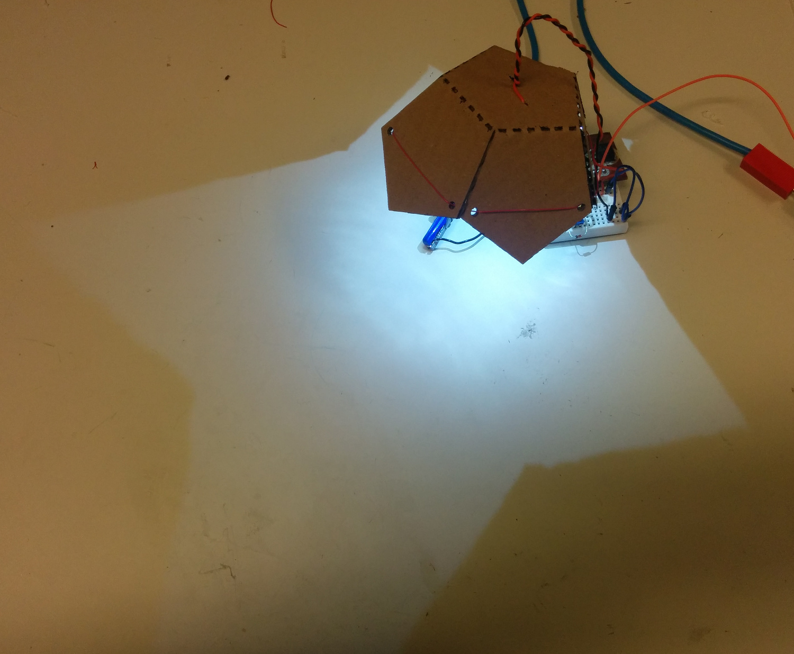
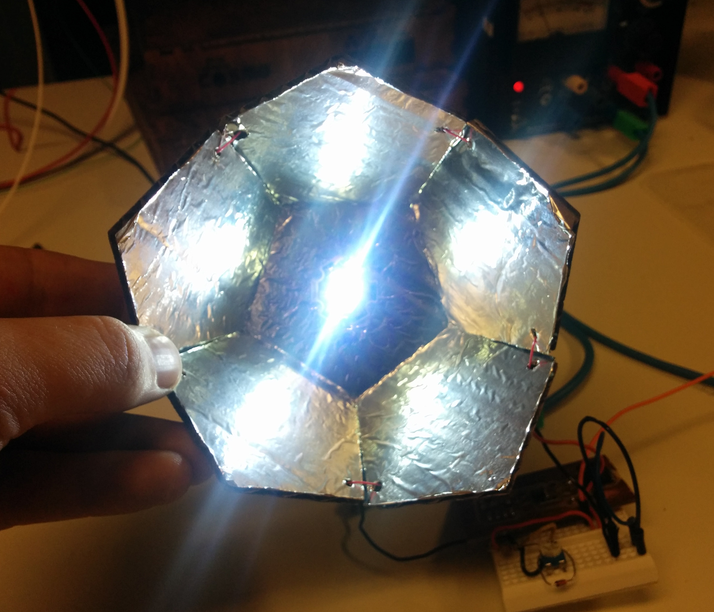
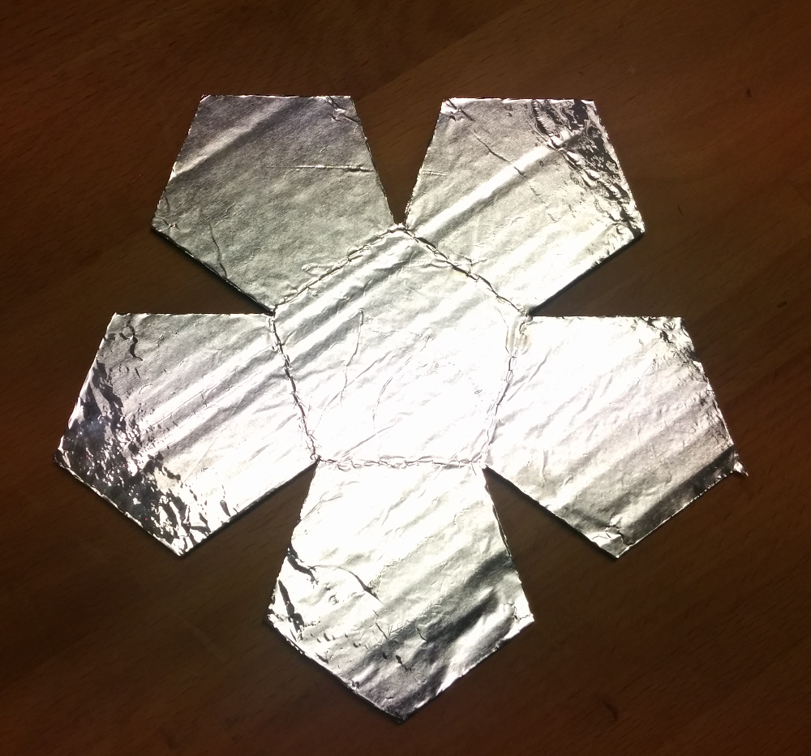

# Pentagonia

Flower-like lamp with pentagon shaped petals. Lasercut with aluminium foil reflector/heatspreader.

Tested for 3 hours with a 1 watt LED (at 350 mA), in 24 deg Celsius ambient temperature.
The temperature of cardboard just behind the LED reached 45 degrees, and the LED module 60 degrees - both fine.

`WARNING: Using a 3 watt LED is untested, and may be unsafe`.

## Source files

[FreeCAD project file](./lamp-penta.fcstd) |
[DXF laser cutsheet](./export/lamp-penta-reflector.dxf)

## Needed materials

* Cardboard or similar bendable material
* Aluminium foil.
* Some wire or yarn
* LED module

## To make

* Take some cardboard. Corrugated or not, both should be fine. Thin PP or PE plastic may also work
* Glue aluminum foil to the material, shiny side up. Regular paperglue will do fine.
* Lasercut
* Cut the aluminium foil open in the slits between the petals (the laser won't affect the metal foil).
* Bend the petals up
* Thread some wire or yarn through the holes on the petals, to 
* Put in the LED. You can put the the wires through the reflector, using it to fasten the LED.

## TODO

* Make a suitable stand for using as reading light
* Try to get the petals to move/open/close
* Check if 3d-printable, using 1-2 layers at bendpoints. Try to print directly onto alu foil.
* Complete similar design, using with more closed hexagonal shape
