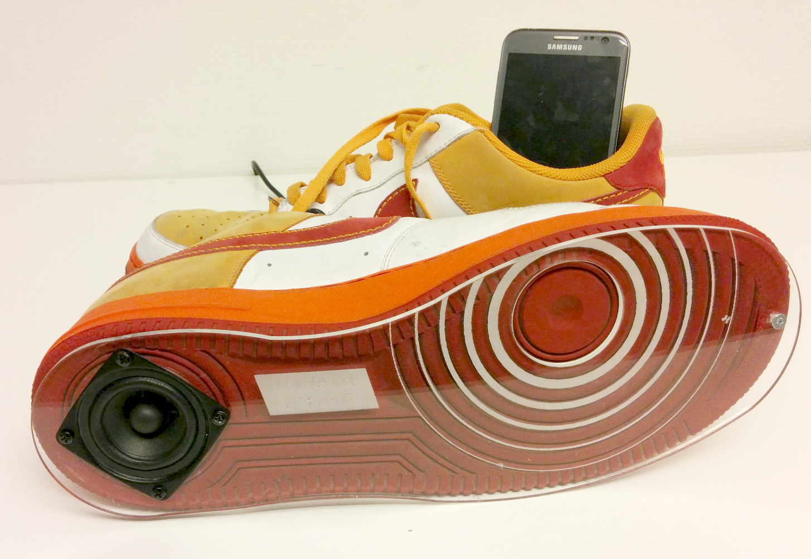

Morning of December 12, I got woken up by phonecall from a filmcrew from national broadcaster [NRK](http://nrk.no)
who were shooting at my local makerspace [Bitraf](http://bitraf.no):

> We're doing this project of making something from thrash and scrap electronics
> The main person who was gonna help us make it has fallen sick..
> Can you be a standin? Right now?
> ... Sure!

## Project intro

The background was a TV series around the topic of alternative thinking on solutions around sustainability.
The core idea was to make a speaker system of scrap electronics, repurpose an household item as , and doing it yourself.

The project idea originated with the person who got sick and not me[1],
he had suggested types of thrash/scrap to bring for it.
The piece also had to fit into a storyarc, with the piece being reused in a following episode
the overall manuscript already written. Quite tricky constraints to work with!
Since I knew nothing about this before hand, there was no way to be prepared[2].

My idea was to preserve the functionality as a shoe.
This especially since the shoes in question were not, by my standard, thrash[3].
We did some semi-successful tests for this concept,
but we ended up making a display piece speaker-set instead, as it better fit with series.

Footnotes:

```
1) I probably disagree about if, or to which degree, a project
   like this helps in terms of 'sutainability'
1) And of course some things took way longer then planned for,
   so the project has to be finished after first round of shooting
3) In my opinion more likely to be discarded/unused due to people buying too many shoes,
   and caring too much about the fashionability of them.
```

## Parts list

* Speakers: From old surround-sound, where amplifier was gone/missing
* Audio jack cable: Also from above
* Amplifier: Unused surround-sound kit lying around
* Enclosure: Pair of shoes which had been discarded by owner
* Powersupply: A laptop charger from discarded laptop
* Faceplate: Acrylic scrap/cutoffs from large-scale company cleanup
* Misc electronics: Some resistors and wires from company closing production facilities

## Tools

* Soldering iron
* Powerdrill, knife
* Lasercutter

## Design files

The faceplate which was cut on the laser was designed mostly in FreeCAD,
with [signature](./sko-signature.svg) and ['soundwave']((./sko-signature.svg) effect done in Inkscape.
Project files here: | [FreeCAD](./sko.fcstd) | [Exported DXF](./sko-total-4.dxf)

Electronics was entirely ad-libbed, so no schematics for that.

## Process

First we discussed ideas for what we wanted to make & express,
and what we could make from the available scrap.

Then we tested the various speaker and amplifiers scraps we had,
disassembled them looking inside to try to find suitable parts.
A first speaker set that looked promising did not any amplifier, but had nice small&powerful speakers.
Another speaker set had amplifier board, but it was huge. It was also fully working & well sounding,
so it seemed a bit of a shame to dissect it for parts.
Later we found an unused amplifier board that had been lying around unused, which was more suited.

Funny scenario happened where Lives husband called, and thought the speaker system
we were taking apart was his (he had same model).

We tested using a small speaker that could fit in the sole without drilling all the way through.
Turned out it was possible to embed a speaker element such that the rim rested on the dampeners in sole.
Quick testing shoed it was actually possible to walk with them comfortably!
However the sound was pretty bad, and a size 46 mens shoe unlikely to fit an unknown gift recipient.
We decided to go with a bigger speaker coming out of bottom sole - doing a display piece instead of a functional shoe.
The 'shoes you walk to the park, kick off, and then use as speakers' project will have to wait for another day or another maker.

So we drilled/cut all the way through, to fit the bigger speaker.
When mounting it was clear that the hole was a bit small to push speaker all the way through.
Then took some scrap acrylic on the laser cutter too make a shim that would also double as a faceplate.

Originally we wanted two speaker elements, but this was too time consuming.
Instead made some engraved sound-waves around the other spot,
to bring out the part of the sole which looked like a speaker cone, giving a bit more symmetry to the design.

For drawing the faceplate outline, I took a picture of bottom of the shoe with mobile phone,
imported in FreeCAD and drew the rough outline on top.
Then cut a couple of tests in some old posters (to not waste acrylic), adjusting it til fit was good.
A couple of material test were needed on acrylic to get the right settings for the engraving.

After assembling the speaker and faceplate,
soldered up the connections between the power supply, amplifier, input cable, and speakers.

Because the laptop adapter only provides one 19V power rail, and the amplifier board expected dual-rail +-10 volts,
I hacke together a small 'virtual ground' adapter using 2x100 ohm resistors as a voltage divider.
Crude but functional for such a small system, when powered from mains and not a battery.

Since there was a Nike logo at bottom of shoe, the thing is no longer a shoe,
and the finished process more of a Live/Jon/Bitraf thing - the logo was covered by a 'Made at Bitraf' signature.

The cables we had were super long, so I though it would be cool to use parts of it as lacing on the shoe.
