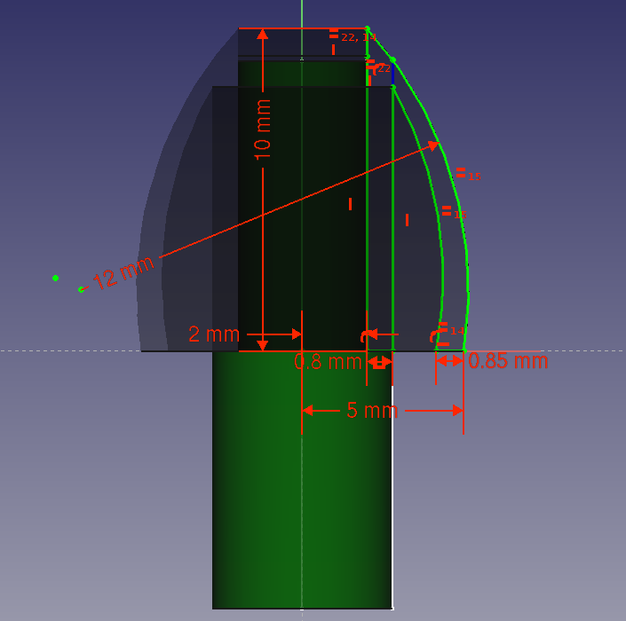
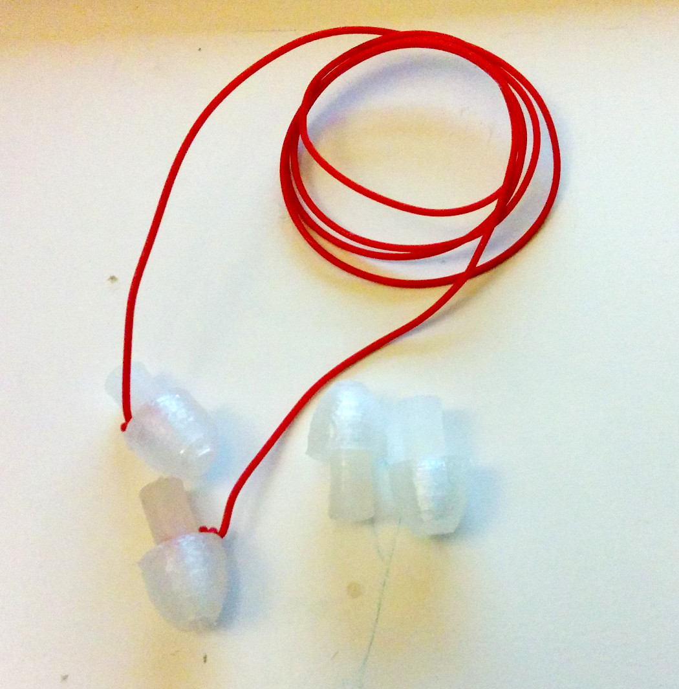

Things for solving practical and personal problems,
made with 3d-printing, laser-cutting and/or CNC milling.

Mostly made with [FreeCAD](http://www.freecadweb.org/)

Wishlist
--------

* Wine saver
* Docking station for Dell XPS 13
* UK-to-EU power adapter. Pressing in ground to open socket
* Bottle/item holder for shower

Done
-----

* Hook for hanging ovenmitts etc on kichen door handle.
[FreeCAD](./handle-hook.fcstd)|[STL](./handle-hook.stl)
* Indicator for keys, to distinguish which door they are for
[FreeCAD](./triowing-keycap-identifier.fcstd)|[STL](./triowing-keycap-identifier.stl)

## Ninjaflex earplugs

[FreeCAD project](./earplugs.fcstd) | [STL bud](./export/earplugs-bud-2.stl) | [STL pin](./export/earplugs-pin-4.stl)

Inspired by modern "HiFi" in-ear hearing protection. Made out of NinjaFlex.
The model could also adapted to make replacement earbuds for in-ear headphones.

I don't have access to a commercial pair right now for comparisons (lost them),
but from 1 hour of usage dampening level and comfort seems comparable.
Looking forward to test during next concerts and travels/flights.

To better fit your ears, you may want to adapt the diameter of the bud in the FreeCAD project file.
I usually use the smallest size (medium can be OK) of commercial in-ear ones, so these are likely at that range.

Print two of each STL for a full pair. You can use NinjaFlex for both parts.
Probably doing the pin in PLA will work fine as well (untested).
When inserting the pin into the bud, it should be a snug fit - should not easily come apart when pulling in the pin.
If you want, you can wrap some thread around the pin to connect a pair together. Makes them harder to lose track of.

Printed with shell size of 2mm and 0% infill for only circular motions.
Also disabled retract and printed in 'one-by-one mode' to minimize need for retract.

**Caution**: FDM 3d-prints are quite porous. This *may* offer bacteria better growing ground
compared to commercial molded-silicon-based earbuds. Consider replacing them regularly.

Similar to [exiting work](http://www.thingiverse.com/thing:484562/#files), but this is 100% printed.

## In progress

Stock items printed
----------

* Comb for hair
* Button for jacket

Documenting 3d-print
=======
Purpose:

* Make print reproducable
* Compare solutions: Cost, labor, performance
* Extract knowledge which can be reused for other prints.

Topics:

* Safety concerns.
* Printing time. Print settings, type of printer
* Assembly/finishing. Steps, time, tools required
* Vitamins used. Part, amount, sources, est. costs, alternatives
* Materials used. Type, amount, est. cost
* Requirements for printer. Build area, Z-resolution, XY-resolution, nozzle width
* Functionality. Verification, performance tests
