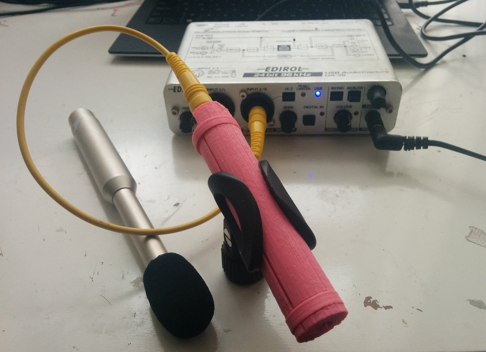
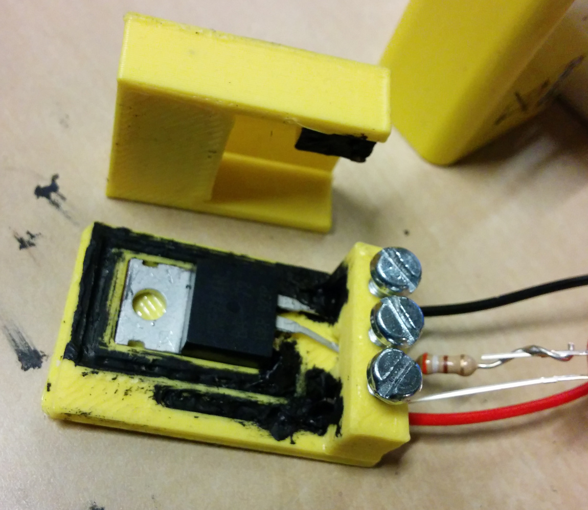

Additive digital manufacturing technicues (3d-printing) brings
many new possibilities and challenges to electronics.

As of early 2015, there are several developments happening
that enable afforable additive manufacturing of conductive material
(and thus basic electronics):

* Specialized printers for electronics. Ex: Voxel 8
* Electronically conductive filament for normal FDM/FFF printers.
Ex: [ProtoPasta](http://www.proto-pasta.com/products/conductive-pla),
[Functionalize F-Electric](http://functionalize.com/shop/),
[PolyMaker Conductive](http://www.polymaker.com/shop/conductive-graphene-filament/),
[BlackMagic Conductive Graphene](https://www.blackmagic3d.com/ProductDetails.asp?ProductCode=GRPHN-175)

It may also be possible to print channels in non-conductive
material and then fill these with low viscocity conductive material (ex: Bare Conductive).

Experiments
===========

USB lights
-----------

References:

* [Seeed Studio: USB PCB connector](http://www.seeedstudio.com/recipe/30-usb-pcb-business-card.htm)

Electret microphone
---------------------

Status: First working version printed and tested.

[DEMO VIDEO on Youtube](https://www.youtube.com/watch?v=UtWn3Vl2V2k&feature=youtu.be)

[FreeCAD](./microphone-electret.fcstd)

Has body diameter of 20.5 mm (13/16 inch), same as many commercial elecret/measurement microphones.
For compatibility with accessories etc.

Vitamins required:

- 1x 9.5 mm electret microphone capsule
- 1x 1uF-100uF capacitor. Polarized OK
- 1x AA battery

For usage, hook up with jack cable (6.3mm 1/8inch) to a mixer/recorder/sound-card **with preamp**.
Future versions might include an integrated pre-amp circuit.

[Suitable mic capsule](http://no.farnell.com/multicomp/mckpcm-97h67-40db-4809/microphone/dp/1758435)

Designed for printing with ProtoPasta Conductive PLA. Will probably work with filaments with less resistance as well. Dual-extrusion not required!
Alternatively, one could use single-core copper conductors ~1.5mm diameter put into the channels manually (solder to components).
Would need to replace the thinnest trace in the top with a 1k-3.3k Ohm resitor, and probably tweak the springs for the jack socket.

High-power active switch
--------------------------

[FreeCAD](./power-switch.fcstd)

The high-current paths of circuit are connected directly to/from the IC
instead of going through deposited traces, side-stepping issues of poor conductivity.
Power handling mostly limited by not having a heat-sink.
Traces currently done using channels in the PLA filled with Bare Conductive ink.
Dedicated resistors uneccesary as trace-lengths are adapted to make suitable resistivity.

Vitamins required:

* 1x TO220 N-channel MOSFET with pinout Gate,Drain,Source (ex: IRF244N, BUZ10/11/12)
* 3x M3 screws

TODO:

* Attach top part to bottom part. Press/click-fit?
* Close wire holes on backside
* Design way to attach Gate-leg as spring in Vin+ hole
* Find way to document which port is what. Embed +, -, O (out) into frontwall?
* Tweak button surface, better indicate where to press, rigidity
* Add external input for gate signal!
* Fix traces to be producable by printed mask w/Bare Conductive
* Run high-current test
* **Publish on Thingiverse**
* Ensure printable with ProtoPasta (pending delivery...)
* Test more advanced control configs, captouch,toggle/RF/timer etc

Similar technique could for instance be used to create:

* Audio power amplifiers, using LM3886 or similar
* Stepper-motor drivers, using microcontroller + H-bridges [avrstmd](http://www.avrstmd.com)

AC power switch
--------------

[FreeCAD](./mains-powerplug.fcstd)

For EU type plug. 
[Socket C](http://www.worldstandards.eu/electricity/plugs-and-sockets/c/)
/[Socket F](http://www.worldstandards.eu/electricity/plugs-and-sockets/f/)

A simple+cheap 230V off-line inductorless DC regulator
like [Supertex SR036] (http://www.mouser.com/catalog/specsheets/sr03.pdf)
would be useful to embed for powering electronics.

Using microcontroller, plus standard 250 VAC coil- or solid-state relay,
could potentially make a generic remote controllable switch.
Example: [JZC-11F](https://www.sparkfun.com/datasheets/Components/General/JZC-11F-05VDC-1Z%20EN.pdf)

Testing ProtoPasta Conductive PLA
--------------
Test1: 0.4 mm nozzle extrusion in free air

- at 220 deg C
- Measuring as close as possible. ~400 ohm. Estimate for contact resistance
- Measuring at ~1 cm, 3500 ohm.
- Stretching the extuded part increases resistance!

Test 2: 1x10x50 mm rod

- 0.2 mm layer height (5 layers). 50 deg C buildplate.
- Contact resistante varies a lot with applied pressure.
Between low and high pressure on multimeter pins, variation over 2000 ohms.
- Unable to reproduce 400 ohm contact resistance, getting ~800, ohms now
- Bending the substrate first deforms up to 15. Does not snap violently, but instead tears up like dry rubber.
- Seems to be able to physically handle a fair amount of mild bends (~15 deg)

Test 3: Bonding to paper

- 1x10x50 mm rod
- Post-it note taped down on build surface
- Running first layer a bit lower than normal (extra "squeeze")
- Sticks reasonably well, approx as how two posts-its stick to eachother
- Bends pretty well with paper for mild bends

Test 4: Bonding to paper with paper-glue

- Using thin layer of 'UHU stic'
- 0.5x5x50 mm rod
- Substrate follows paper very well, have to force it apart starting at the edges
- Can bend rod 180 degrees around middle
- Still not perfect for flexible parts due to rigidity
- Note: in ideal electronics 0.5x5 should have had 4 times the resistance of 1x10.
Real results were only 2x, 3k versus 1.5k ohm. Contact resistance of 700 ohms does not explain all. Sub-optimal layer2layer resistance?

Test 5: Solderability

- Using regular 15 watt hand-soldering iron, 40-60 solder
- Attempted to solder edge of broken 1x10mm rod
- Plastic melts and deforms away from the solder. No sign of wicking action
- Seems impossible to solder, at least in conventional terms
- Can probably use soldering iron to join two conductive plastic parts together

Test 6: Rotary potmeter (FIXME: add picture)

- End-to-end resistance of track was 2.8 k ohm
- However even with medium pressure on viper, the resistance was often over 5-10k ohm
- Using a metal viper did not reduce the variability significantly, though it elimitated extra reistance of viper
- Using water/spit on the track also helped suprisingly little
- Any practical design will need to
1) Ensure high and constant pressure between wiper (using springs etc)
2) Have a high resistance in track, on order of 100-500k ohm, to make the relative effect low.
- Work by others: http://www.thingiverse.com/thing:172845
- Holding two pieces of filament perpendicularly against eachother has much less variance.
However trying to piece them back together where broken off yields higher and variable resistance.
Suggesting that the surface a lot to say.

TODO:

- Test bonding to electronics components
- Test bonding to PLA
- Compare resistance when increasing width versus height (layers)

## Electroplating conductive filament

Previously people have [electroplated 3d-prints by painting](http://bryancera.blogspot.com.au/2014/09/copper-electroplatingforming-3d-prints.html)
with conductive graphite paint. The failed [Orbit1 Kickstarter](https://www.kickstarter.com/projects/1499748748/orbit1-a-tabletop-electroplater-turns-your-ideas-i)
used similar concept.

We wanted to see if one could do it directly on conductive filament, like ProtoPasta Conductive.
Experiement done by [Kim Øyhus](http://kim.oyhus.no/), borrowing some filament from me.

After some attempts, an even coat was achieved.

The rightmost sample was created by using:

* About 1/300 solution of copper sulfate in water
* Copper cable as donation anode
* Depositing time was around 12 hours for rightmost (best result).
* A magnetic stirrer to keep solution circulating

It looked like a thinner solution gave more even deposition, and that circulation is critical.

Further investigation:

* Can one solder the filament with deposited copper?
* Are there practical ways of depositing on each trace of a electronic circuit?
Maybe have joining traces which are then broken off? Or just a bed-of-nails type connection setup?
* Can one plate copper onto a combination of components and traces, to skip soldering completely?

Braindump
=========

Ideas for pieces
--------

* An electronic windchime, where conductive filament is used to sense wind/movement?
* Joystick 4/8-way
* Microswitch for use as endstops

Key process parameters
--------------------

* Conductivity of material
* Capacitance and inductance
* Strength and flexibility of material
* Bonding to other conductive materials: component, PCBs etc
* Bonding to non-conductive material

Thoughs on designing for print
---------------

**Resistance**

In the forseeable future (2015) of additive manufacturing,
the conductive materials are pretty poor compared to in conventional 
electronics manufacturing, having a factor 100-1000 higher resistivity.
The significant resistance of available conductors will mean that many
conventional designs will work poorely when produced in this new way.
It might be required to re-think not just the manufacturing, but also
(parts of) the design of electronics to be able to make working systems.
The significant resistance can however be used to reduce or eliminate
actual resistors, at least in applications where high tolerance is not needed.

**Hybrid**

It is tempting to try to make systems where everything is 3d-printed.
In the forseeable future however, we need to reuse existing technology where
makes sense, and 3d-printing where that makes sense.
The obvious place for additive manufacturing, is the assembly of components into a (sub)system
(traditionally: PCB board manufacturing).

However, more importantly one can potentially now produce sensors, actuators and enclosures
*in the same process* as the functional system, which in conventional
thinking are only somewhat-overlapping problems. This opens up new possibilities in
integrated systems design, if one re-thinks the exising boundaries.

**3D**

Conventional electronics is nearly almost only oriented around 2d. The added dimension
should enable more compact designs, as well as more flexibility in integrating/interfacing
with other 3 dimensional objects.

**Scale**

Electronics is traditionally very oriented around standardized, reusable components.
Each component is cheap because it is produced in the millions and can
be used for many purposes. However there is a significant cost in producing
the custom parts, both for connects the re-usable components and providing
chassis/enclosure and interfacing. Sourcing and stocking all the different
components also incurrs significant costs.
The current processes there also scale well with high quantity
(or conversely, scales poorely with low quantity). This naturally
opens up for alternative technologies for low-quantity manufacturing,
or where. 

Some factors that could possibly exploit to also scale up to medium-size quantities:

* Just-in-time manufacturing, saving storage costs
* Distributed manufacturing, saving shipping costs
* Universality, every system made up of connected digital controllers + custom 3d-printed parts.

**QA**

Traditional manufacturing methods also have very well established quality assurance systems.
Successful commercial use of additive manufacturing will likely require the same.
Some additional challenges are introduced because of the currently still unmature/developing
nature of the materials and processes. Designing ways to do effective & efficient QA on
a low-quantity scale is seemingly an unsolved and untackled problem.

**Recycling**

If all the components (potentially reusable, or individually recycable)
are baked into the object being produced, with no way of dissassembling,
this requires new solutions for recyling.
The conductive material itself also needs a way to be recycled.

Software (EDA/CAD/CAM)
-----------------

Traditional EDA tools very limited 3d-capabilities.
Traditional CAD/CAM very little knowledge about electronics.

Want to at least be able to import netlists from schematic capture,
and have a way to establish connections with traces. Each unfulfilled
connection should be shown as warning/error.

One could try to do layout primarily in multi-layer 2d EDA,
and then let adapt this to 3d-printing by doing vertical paths
instead of vias.
Problem is that few (if any?) tools will allow placing components in
more than two layers (front+back). It is also assumed that these two
planes are parallel, severely limiting component placement.
Orientation of components is limited to rotation around Z-axis,
again limiting layout (and thus complicates routing).

Since traces have non-neglible resistance, having automatic calculation
of trace resistance for a given 3d-path is critical. A warning when
trace resistance is too high for design requirements massively beneficial.
Ideally the auto-router would know about resistance, and be able to lay out traces
to create a given resistance.

Since it will be possible to print whole components in some cases, like
connectors, a way of representing and manipulating such components would be needed.
Having a resuable (ideally shareable) library should significantly speed up development process.

Tools
------
* Finite Domain Solver (fd.js) for calculating lengths/crossection/resistance
* [KiCAD](http://www.kicad-pcb.org/): EDA tool, including schematic capture, and many component 3d-models
* [eaglepcb2freecad](http://sourceforge.net/projects/eaglepcb2freecad) for importing KiCAD into FreeCAD
* DigiKey, has huge [repository of 3d-models](http://www.digikey.com/en/resources/3d-models)

Calculating connections
-----------------------

Assuming cross-section same along whole path

    R = ρL/A

    R: fixed by requirements in circuit design.
       Ratios to others might be more important than exact value
    ρ: fixed by material property. Likely need calibration
    L: variable, highly influenced by component positions 
    A: variable, constrained downwards by minimum nozzle/lines,
       constrained upwards by size limits of single conductor
       0.4*0.4mm <-> 4*4mm, factor 10*10 = 100

Challenge: resistance of paths different between layers than within a layer.
Try to keep them the same for all paths?

Possible strategy:

1) Attempt to solve for A, keeping L constant
2) Modify path to be longer by not following path directly

Step 2 can potentially be done in discrete steps:

Direct line along path

    *-----------------------*

Multiple lines parallel to direction of path. N lines, X % of path

      -------------------
      |                 |
    *-|  ---------------    *
         |                  |
         ---------------------

Multiple lines perpendicular to direction of path. N lines, Y millimeter extension

      --- ---
      | | | |
    *-| | | | |-*
        | | | |
        --- ---

All these are periodic patterns, which allows to calculate effective resistance per period
then multiplying up to get total for path.
Could also do more complex paths in 3D.

Coping with variance in conductivity
--------------------

Run various testcases on conductivity.
Establish relationships between

* Resistance versus number of lines
* Resistance versus number of layers
* Resistance versus length
* Resistance variability/repeatabilit
* Resistance versus temperature, w/without curing
* Resistance over time

Trimmable.
Circular/linear track with viper (potmeter)
Cutting off pieces of pattern, or joining together

Possible testcases
-------------

Sensors

* Touch (capacitive?)
* Proximity (inductive?)
* Vibration, low-frequency
* Vibration, audio
* Current consumption
* Rotary encoder, for user input

Sensor interfacing/conditioning

* Piezo microphone preamp
* Electret microphone. Can print shotgun mic!

Control systems

* Momentary switch (non/inverted)
* Latched switch. SR-latch
* Toggled switch. T flip-flop
* Timers (astable, monostable)
* RF controlled switch (433Mhz/BT/WiFi)

Signal connectors

* 1/4" 6.3mm 'jack'. Male/female
* 1/8" 3.5mm 'minijack', Male/female

Power connectors

* Mains/Wall socket plug. 110/230V
* USB male&female. 5V
* Car/sigarrette adapter. 12V

Battery connectors. Note: tons of designs for non-conductive already on Thingiverse!

* 9V. AAA, AA. CRxxXX

It would be beneficial to establish best-practices for
various classes of electronics (sub) circuits:

* Discrete digital signal processing.
* Analog signal processing.
* Embedded microcontrollers.
* Power electronics

## Related

Work by others

* [Servo mount for lightswitch](http://www.thingiverse.com/thing:1156995)

Commercial offerings

* [Computer-controlled micropipette with conductive glue](http://www.sonoplot.com/printed-electronics).
Using ultrasound (probably piezo), to control dispensing.

References

* [Jeri Ellsworth: Resistive Multi-touch Pad Prototype](https://www.youtube.com/watch?v=eP0PUwS4jzI)
