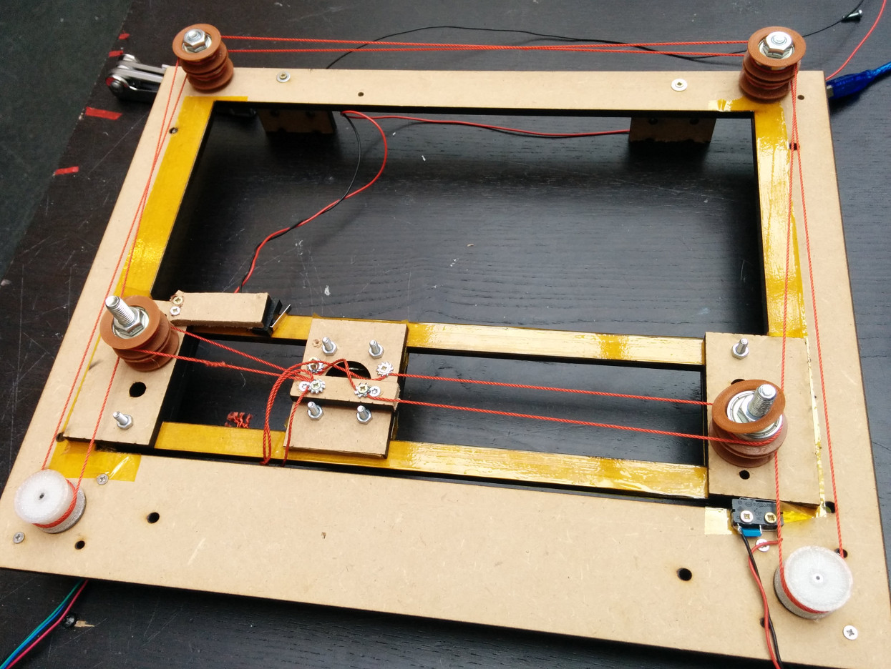

# TapeXY

Experiment in super low-cost XY stage, for uses in digital fabrication techniques
which have minimal weight and forces on head (laser engraving, 3d-printing).
Inspired by the [RishaLaser](http://rishalaser.org) project.

[Youtube VIDEO](https://www.youtube.com/watch?v=5F9-HIbBYwc)

Key features:

* Using Kapton tape as basis for gliding surfaces,
inspired by [a design](http://www.thingiverse.com/thing:3554) by Peter Jansen
* Using braided Nylon/Polyamid wire ("Spectra line") instead of timing belts.
Like on Tantillus and some Delta printers.
* Reproduction with primarily lasercutter (or CNC mill), in wood/acrylics.
* [CoreXY](http://corexy.com) kinematics

Parts:

* Base [FreeCAD](./tapexy.fcstd)
* Gantry [FreeCAD](./tapexy-gantry.fcstd)
* Pulleys. NinjaFlex/SemiFlex for friction. [FreeCAD](./pulley-ninjaflex.fcstd)
* Idlers. 8 pieces, consisting of 1x 608 bearing, 1x M8-40mm bolt and 2x [sideguides](http://www.thingiverse.com/thing:31216)

TODO:

* Change pulley/belt design from dual to single plane, with horizontal offset
* Design a proper belt/line attachment and tensioning system
* Add mounting holes for endstops
* Mount laser diode, run tests
* Maybe use double plates on gantry for stiffness. Also for base?
* Design some self-adjusting system for friction parts

Later:

* Reduce number of screws used, by having lasercut pins instead
* Prototype a fabbable bearing, also using Kapton tape?

Research

* Coefficient of friction.
[Table](http://www.goodfellow.com/catalogue/GFCat2C.php?ewd_token=Q4ZIFOAVRhE2dSOYkbUxPMdSBZyxXk&n=Ab6sV0qHM8iAeitFJGlgDA1qjQCrhQ&ewd_urlNo=GFCat26&type=30&prop=3)
Kapton/Polyimide: 0.45, Teflon/PTFE: 0.05-0.2, UHMW PE: 0.1-0.2.
