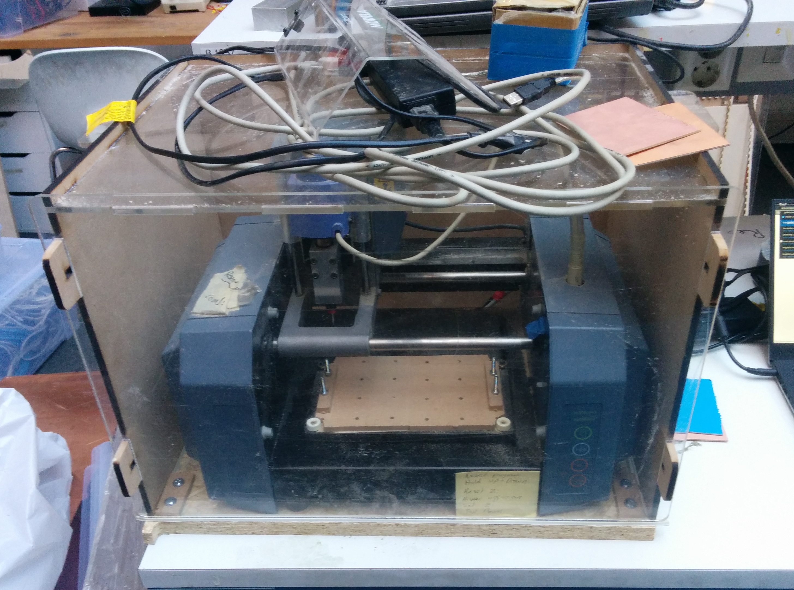
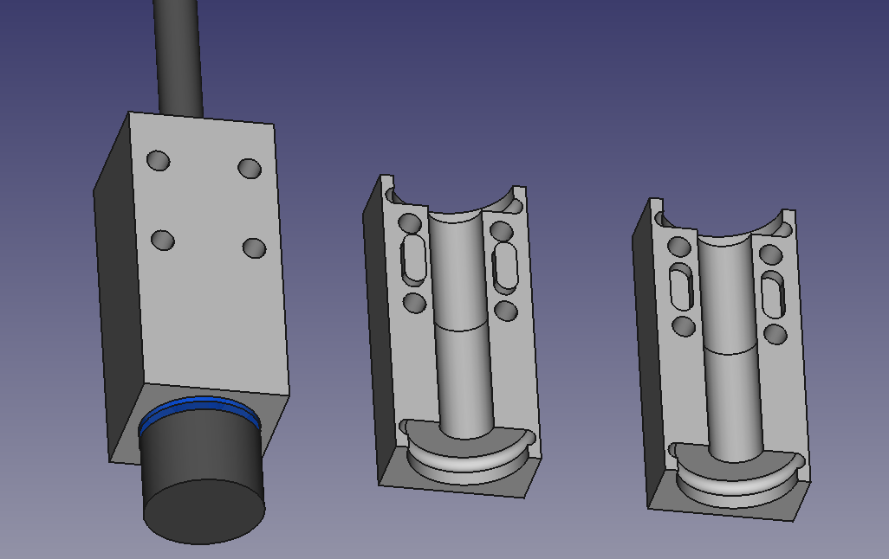

# Parts for Roland Modela

Designed for Roland Modela MDX-15 at [Bitraf](http://bitraf.no) hackerspace.

## Clamping system

Designed to be milled on the Modela itself, from 5-8 mm material, using ~2mm endmill.
The roundclamp is 3d-printed.

The base doubles as a sacrificial layer, and can be planed by the mill to ensure perfect flatness.
Full worksize plates can be fixed with the sideclamps only,
smaller pieces with the roundclamps or combination of side+roundclamp.
You can still use double-sided tape, if that is preferred. 

Vitamins needed:

* 4 M4x30mm hex bolts (for sideclamps)
* 20 M4 nuts (for underside)
* 2 M4x10mm Allen screws

Parts:

* Base 2x
| [DXF](./export/rml-clampbase-half-1.dxf)
| [FreeCAD](./clamping.fcstd)
* Sideclamps
| [DXF](./export/rml-sideclamp-1.dxf)
| [FreeCAD](./clamping-sideclamp.fcstd)
* Roundclamp
| [FreeCAD](./clamping-roundpuck.fcstd)
| [STL](./export/rml-roundclamp-2.stl)

### Planing

Use a 6 mm endmill at 5 mm/sec, 0.5 mm cut depth.
Fill a rectangle of 152 x 100 mm (with origin X=0, Y=0).
Might want to go 2 passes, for total depth of 1 mm.

## Noise isolating box

Inspired by the [boxes at Fablab Lyngen](http://www.dyvikdesign.com/site/research/fablab/the-modela-insulation-boxes-of-fablab-lyngen.html),
redesigned in FreeCAD and using joinery that avoids glues and screws.

[FreeCAD source](box.fcstd) |

Parts

* 6 mm MDF or other woods. Parametric design; can be easily tweaked for 5-10 mm.
* 5 mm acrylic or polycarbonate
* http://www.clasohlson.com/no/b/Jernvare/Beslag-og-opphengning/Tetningslister

TODO

* Redesign front to be in MDF too, with an acrylic door/plate which slides up.
Then don't have to lift the box all the time.

## PCB blanks

Conrad: FR1 [100x50 mm](http://www.conrad.com/ce/en/product/528200)

## Course in making PCBs

Theory intro

* Motivation for making PCBs locally
* CNC milling PCB versus etching
* How isolation milling works
* Safety considerations, fibreglass and copperdust
* Where to get materials/tools
* Important design (minimal trace distance, traces width)
* SMD is easier/nicer than holes
* Exporting design (Fritzing/EAGLE/KiCAD)

Demo

* How to prepare exported design. Flipping if export is from underside. Aligning cutouts
* Importing
* Settings
* 
* Traces isolation milling
* Changing tool, setting Z-height
* Board cutout

Practical

* Each participant imports demo design traces
* Puts in the board
* Sets up settings and positions XY, Z
* Runs the job

Prepare

* TODO: demo circuit. Is touchflower CR2032 OK? 6-8 per board. Approx 2 min isolation
* Document the process on wiki
* Pre-cut a number of boards, 1 per participant
* Make some slides for theory intro

Related

* Electronics: Working with surface mount components

## TODO

Course

* Get 3x 230v extension cord
* Maybe elevate machine a bit
* Attach spindle bracket better in bottom corner
* Document PCB mills. Burr, isolation engraver. Buy for Bitmart?
* Fix front slide up
* Get dedicated wrench set. 11 + 17mm

After

* Test vacuum bed. Pockets dedicated for PCB blanks. Dedicated 12V vacuum pump

## Ideas

Make a streaming gcode-2-RML converter, translating gcode on the fly to the propritary (and badly supported) .RML format.
Can then use all tools which output gcode. Like Vectric VCarve (used for Shopbot), Fusion 360, FreeCAD and various PCB-specific gcode tools.

Auto-leveling would be very desirable, especially for milling PCBs.
[Autoleveling with Shapeoko+GRBL](http://www.shapeoko.com/forum/viewtopic.php?f=28&t=3797).

## Replacement spindle

[FreeCAD source](./er11-spindlemount.fcstd)|

Motivation

* Tool fastening is not that great.
Need to replace entire unit for different shank size, only some sizes are available.
Each type is pretty expensive.
* Motor is very weak, and (semi-expensive) consumable.

Prior art

* https://grabcad.com/library/collet-type-spindle-unit-for-roland-modela-mdx-15-20

Parts

* ER11 C8 spindle
* ER11 collets for different shank sizes
* 608 bearings
* Custom machined adapter

TODO

* Figure out efficient way of machining spindle mount/adapter.
Few pieces, few-sided milling job, good registration.
Can we split part down the middle? Then becomes two-part, one-sided milling, no registration.
Challenge is cutting good (half) circles for the bearings to sit in.
In the naive (evenly segmented XY) approach, bearing will be held in by an N-gon with only edges connecting.
A continous half-circle path in XZ will do much better. Can this be done with FreeCAD Path/CAM?
* Design & make spindle mount/adapter.
Preferably attach to the 4 hex screws that originals use.
* Find a replacement motor. Brushless with ESC seems ideal?
Should start on the spindle-on signal from MDX. Is this just 12v?
Ideally can use the same power-supply and connector also.
* Make adapter for replacement motor unit

References
------------

Addons

* [Nice dust extraction system](http://wiki.makeitlabs.com/projects/roland-mill-upgrade/upgrades)
* Cyclonic dust separator. [Vid](https://www.youtube.com/watch?v=YsrURCK-H_M)

Replacement parts

* [Spindle motor (MM-40)](https://www.rolanddgastore.com/product.aspx?zpid=1475)
* [Spindle 3mm (PS-3)](https://www.rolanddgastore.com/product.aspx?zpid=1500)

## Working with small parts

Castellated breakouts of fine-pitch pacakges to 1.27mm castellated: https://github.com/coddingtonbear/kicad-castellated-breakouts
