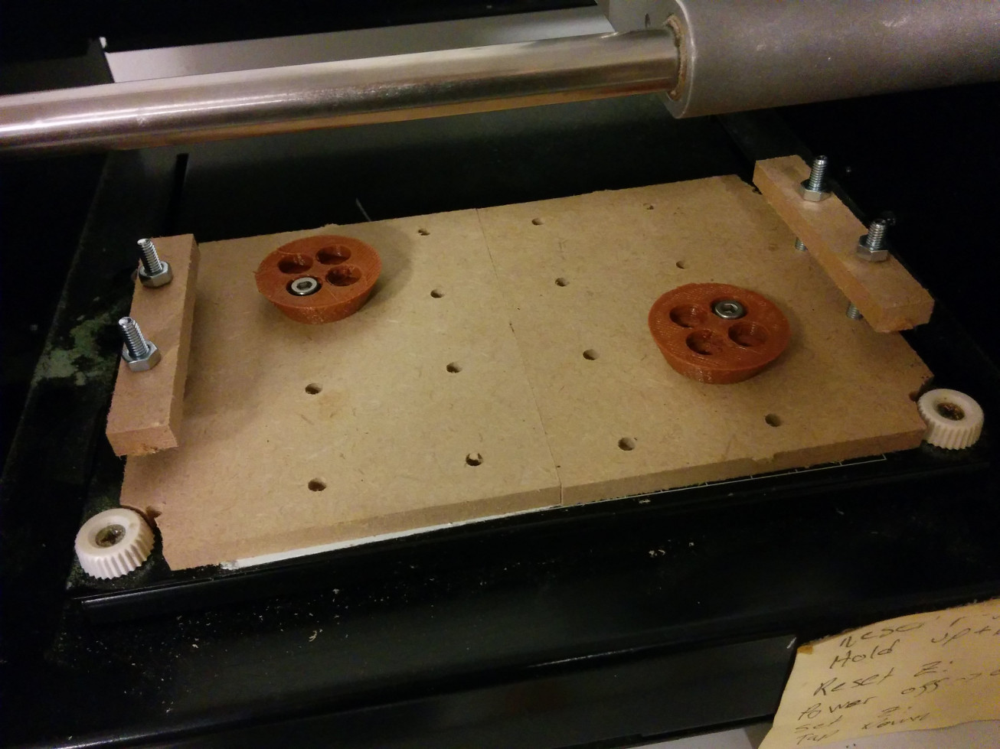

# Parts for Roland Modela

Designed for Roland Modela MDX-15 at [Bitraf](http://bitraf.no) hackerspace.

## Clamping system

Designed to be milled on the Modela itself, from 5-8 mm material, using ~2mm endmill.
The roundclamp is 3d-printed.

The base doubles as a sacrificial layer, and can be planed by the mill to ensure perfect flatness.
Full worksize plates can be fixed with the sideclamps only,
smaller pieces with the roundclamps or combination of side+roundclamp.
You can still use double-sided tape, if that is preferred. 

Vitamins needed:

* 4 M4x30mm hex bolts (for sideclamps)
* 20 M4 nuts (for underside)
* 2 M4x10mm Allen screws

Parts:

* Base 2x
| [DXF](./export/rml-clampbase-half-1.dxf)
| [FreeCAD](./clamping.fcstd)
* Sideclamps
| [DXF](./export/rml-sideclamp-1.dxf)
| [FreeCAD](./clamping-sideclamp.fcstd)
* Roundclamp
| [FreeCAD](./clamping-roundpuck.fcstd)
| [STL](./export/rml-roundclamp-2.stl)

## Noise isolating box

[FreeCAD source](box.fcstd) |

Parts

* 8 mm MDF or other woods. Parametric design can be easily tweaked for 5-10 mm.
* 5 mm acrylic or polycarbonate
* http://www.clasohlson.com/no/b/Jernvare/Beslag-og-opphengning/Tetningslister

Inspired by the [boxes at Fablab Lyngen](http://www.dyvikdesign.com/site/research/fablab/the-modela-insulation-boxes-of-fablab-lyngen.html),
redesigned in FreeCAD and using joinery that avoids glues and screws.

## TODO

* Mount Raspberry PI. Install fabmodules on it
* QR code + link for accessing webinterface
* Consider mounting a tablet
* Vacum attachment / dust-shoe
* Toolbox. For replacement parts, milling bits, double-sided tape, allen keys etc

Fabmodules

* Add code upload/send (from any source)
* Make the sender report progress over Webinterface instead of native TKinter.
Consider checking out the work in [ChiliPeppr](http://chilipeppr.com/), and reusing the server part/interface.

References
------------

* [Nice dust extraction system](http://wiki.makeitlabs.com/projects/roland-mill-upgrade/upgrades)
* Cyclonic dust separator. [Vid](https://www.youtube.com/watch?v=YsrURCK-H_M)
