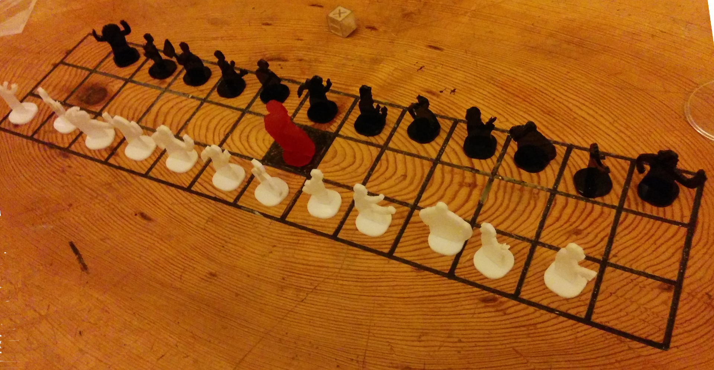
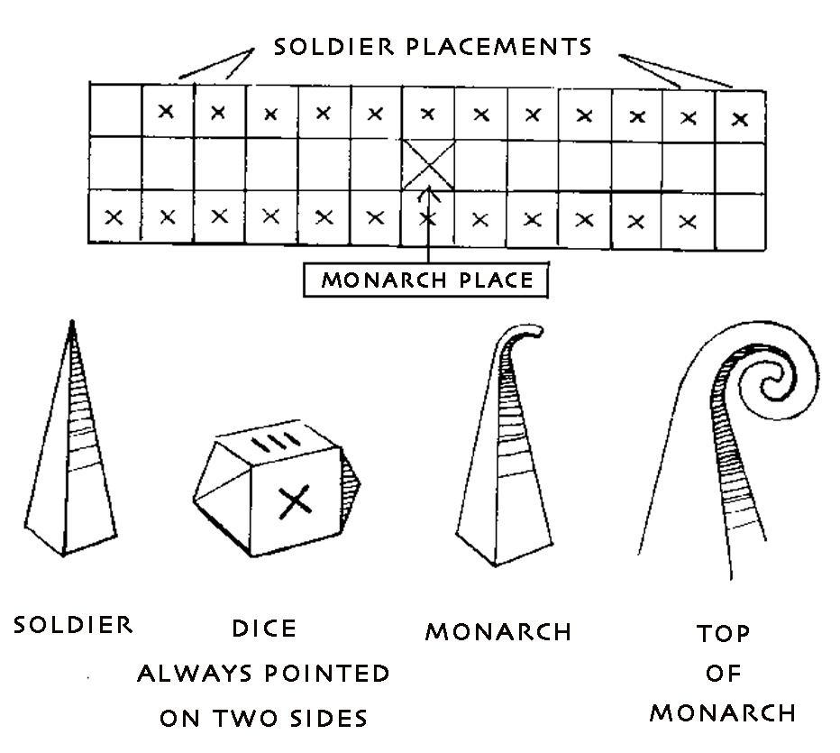

# Sakko

Sakko is an old game, played by people of the Lyngen area.
It was recently [rediscovered](http://www.fablab.no/index.php/news-nyheter/229-206) at MIT Fablab Norway,
and you can fabricate the pieces & board [with a mill](http://www.inference.phy.cam.ac.uk/cs482/fablab/projects/sakko/).

Some oldish pieces can be found [at Norsk Folkemuseum](http://digitaltmuseum.no/011023295017).

At the Nordic Fablab Bootcamp 2016, we picked up the game again. One of the things we did,
was to make a personalized set of pieces from each of the participants.

## Figurines

## Process

We took pictures of each person, with a flashlight to project a shadow on a white wall.
This captures their silluette, making for a super-simple '2d scanning' technique.

The shadow-play type setup also made participants quite creative. I told them to imagine themselves as an action figurine.
Using a standard smartphone camera. Noise from the sensor made cleanup a bit difficult, focus
and the impromptu light-setup had a spot which was a bit smaller than desirable.
Using a proper camera with a tripod, and putting the light onto a tripod would make it easier to take
the photographs, and require less post-processing.

Then the images was imported into Inkscape, and using [Trace Bitmap](https://inkscape.org/en/doc/tracing/tutorial-tracing.html)
to convert it into vector shapes. Some cleanup was done, primarily using boolean operations like Intersection to isolate the shape,
and Difference to cut of some excess parts. Then a pin for insertion into the base was added using Union.

The parts are cut out of 3mm acrylic, and the siluttes are fitted onto base with a press-fit.

[Inkscape project, siluettes](./figures.svg) | 
[FreeCAD source, for base](./sakko-solider.fcstd) |

## How to play the game

*Originally in Norwegian, unknown author. Translation by Zenna Fiscella, January 2016.*

Sakko is a board game with dice and game pieces which has been in use in some areas of Norweigan northern Troms even contemporarily, although it is uncertain exactly how old the game is. Sakko could be an indigenous game, but it could also be that they have inherited it, since it seems to be mostly spread in coastal areas. Sakko may be from the era of Vikings but the shape of the royal piece pointing in a direction that it could be from Catholic times in Norway, then the top of the King piece is reminiscent of a pastoral staff.

It is uncertain what Sakko means. Friis considered Sakko as a distortion of chess, while others assume that Sakko is a word borrowed from Old Norse, meaning money fine, but some safe dating or on the game's origins have not. In finish Sakko means fine as well, commonly used for speeding tickets. For comparison, the knowledge of the Viking board game, Hnefatafl has sources which have been preserved from Lappland dated 1723.
Usually the Sakko board is a wooden board with 3 x 13 squares although the number of horizontal squares and pieces have varied little through the ages. In older times they were cut into the board with a knife. Game pieces and dice have been carved out of everything from wood, whalebone, walrus tusks and horns from various animals and then cast in lead.

The dice is special in Sakko, it has only four sides showing "eyes" (see photo above) while two opposing end surfaces are pyramid-like which prevents the dice to land on them. The other four pages that show "eyes" are labeled X (called Sakko), I (one), II (two) and III (three).

The Monarch piece is a pyramidal shape slightly larger than the soldier-pieces, and the top is always dragged out to a larger or smaller hook. (Obviously not necessary if you want to recreate it - the main thing is to keep track of which pieces is which). The two players troops were labeled in order to distinguish between them, either by giving the different colors, or by carving into one of the players sets.

### Game Rules

Two participants play against each other with 12 soldiers. To decide on who starts one flips a coin, or trows the dice. If one decides by dice the first player to roll X (Sakko) gets to start. The game uses two dice.

The soldiers are lined up on the boards two outer rows which leaves an open field in front of them. The king is then set up on the middle field (7.de) in the middle square.

To make a soldier available the player must get an X (Sakko), the player then gets to move the soldier one step forward. One is free to choose whether one frees a soldier and moves it one step forward or if one moves a previously freed soldier.

After rolling sakko the player gets to roll the dice again. If the dice show two sakko the player gets to roll again with both dice.

When a soldier has been freed it gets to move as many steps forward as the dice shows. When it gets to the middle row, it turns around and goes in the opposite direction, once it reaches the end here it gets to enters the opposing which belongs to the opponent. If it gets through this it goes back to the middle row and proceeds as previously mentioned. If, on its way, the soldier on the move encounters a soldier belonging to the opponent it knocks it out. Hit it on its way on a route one of the opposing soldiers, turning it this. If the soldier reaches the square of the monarch it will conquer the monarch and go the same way as the soldiers, beating the opponents pieces.

If the opposing soldiers end up on the same square as the conquered king it will in turn conquer the monarch and start going to opposite direction. Thus the monarch may so change hands several times during the game and this may result in one of the players only having the king left with all the soldiers knocked out.

The soldiers move forward as many squares as the dice shows. One solder may only move the amount shown on one dice, not the collected amount. Instead the player can move several soldiers per turn.

The player may have more than one soldier on a square but risks losing all of the soldiers to the opponent if the monarch passes by or a soldier lands on that square.

Counting follows: Sakko, Sakko-Sakko, one-Sakko, two - Sakko, wood, - one, two, - one, three, - two, three. Sakko must always be counted first whether used to free a soldier or for moving a freed soldier or monarch one step forward.

If an enemy soldier stands on a square which is within reach of the players solders, the player may remove the enemy piece. The game continues until one of the parties has lost all his soldiers or only the king is left on the board.

